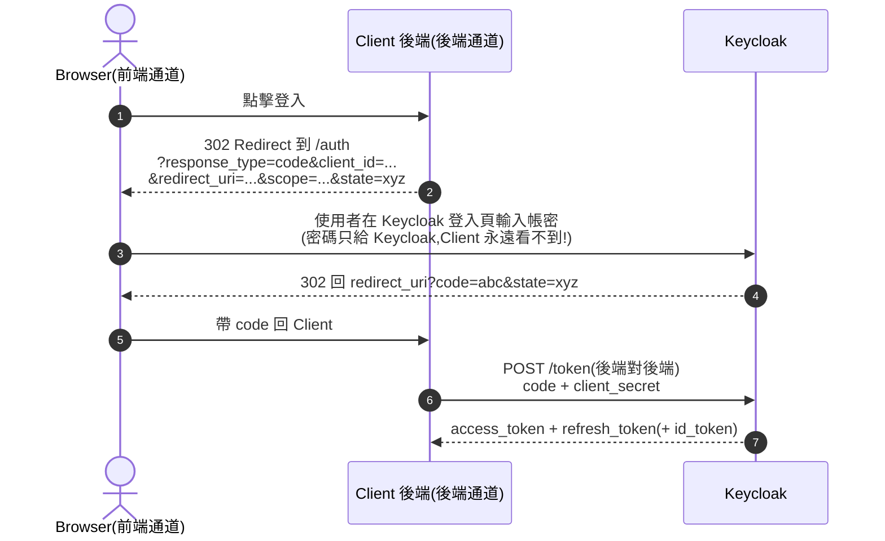
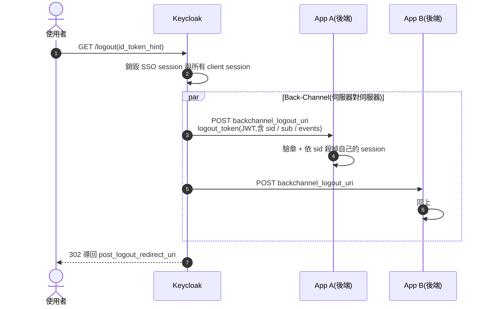
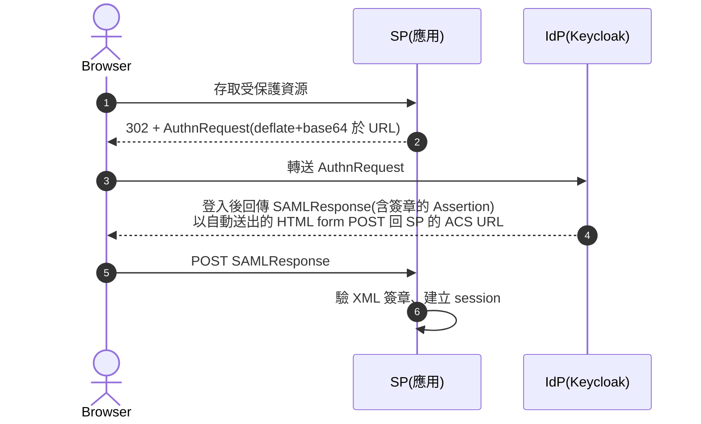
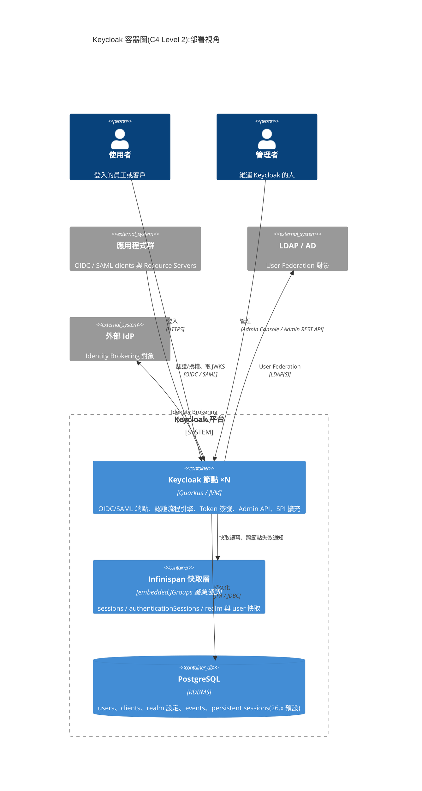
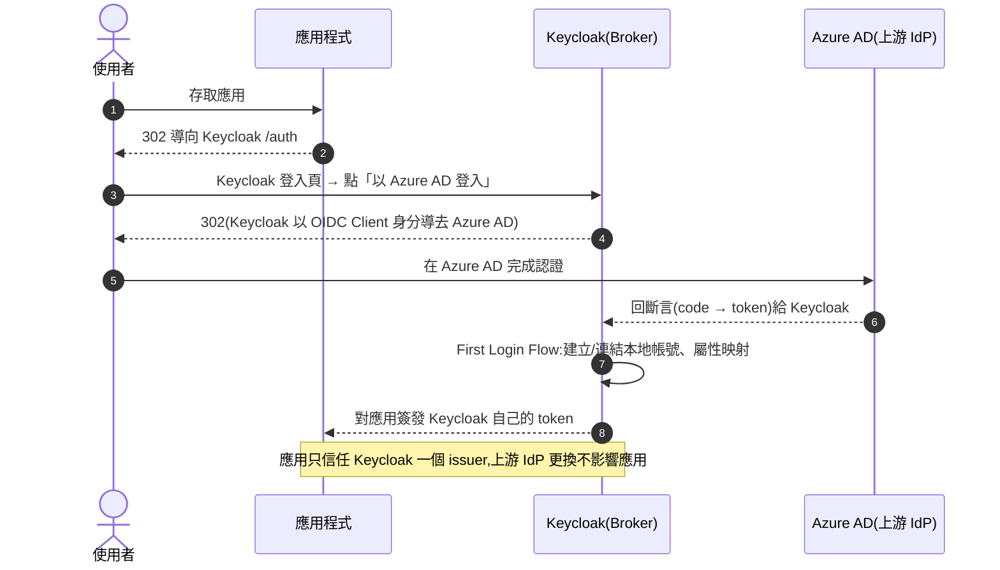

# Keycloak 完整學習教材(From Protocol to Production)

> 一份從**底層協定原理**出發、貫穿到**企業級生產部署**的 Keycloak 系統化學習路徑。
> 目標讀者:應用架構師、後端工程師、DevOps / SRE、需要導入 IAM 的技術顧問。
> 適用版本:Keycloak 26.x(Quarkus 發行版),概念適用於 22+ 所有版本。
>
> **搭配使用:** [`README.md`](./README.md) 是初學者的動手教材(用 `curl` 走完每個流程);
> [`spring-boot-lab/`](./spring-boot-lab/) 是可建置執行的整合實作(Spring Boot 3 × DDD × 六角形架構),對應 Module 7。

---

## 目錄

- [課程總覽與學習路徑](#課程總覽與學習路徑)
- [Module 0:IAM 基礎概念與問題域](#module-0iam-基礎概念與問題域)
- [Module 1:密碼學基礎(理解 Token 的前提)](#module-1密碼學基礎理解-token-的前提)
- [Module 2:OAuth 2.0 底層原理](#module-2oauth-20-底層原理)
- [Module 3:OpenID Connect(OIDC)底層原理](#module-3openid-connectoidc底層原理)
- [Module 4:SAML 2.0 與傳統企業 SSO](#module-4saml-20-與傳統企業-sso)
- [Module 5:Keycloak 核心架構剖析](#module-5keycloak-核心架構剖析)
- [Module 6:安裝、設定與 Realm 管理](#module-6安裝設定與-realm-管理)
- [Module 7:應用程式整合實戰](#module-7應用程式整合實戰)
- [Module 8:User Federation 與 Identity Brokering](#module-8user-federation-與-identity-brokering)
- [Module 9:授權服務(Authorization Services / UMA)](#module-9授權服務authorization-services--uma)
- [Module 10:SPI 擴充開發](#module-10spi-擴充開發)
- [Module 11:高可用叢集與 Kubernetes 部署](#module-11高可用叢集與-kubernetes-部署)
- [Module 12:安全強化、維運與監控](#module-12安全強化維運與監控)
- [Module 13:企業實戰場景(金融業視角)](#module-13企業實戰場景金融業視角)
- [附錄 A:常見面試/評估問題](#附錄-a常見面試評估問題)
- [附錄 B:參考資源](#附錄-b參考資源)
- [附錄 C:錯誤訊息排查對照表](#附錄-c錯誤訊息排查對照表)
- [附錄 D:近期版本演進重點(22 → 26)](#附錄-d近期版本演進重點22--26)

---

## 課程總覽與學習路徑

### 學習路徑圖

```
Phase 1(原理層,約 2 週)
┌─────────────┐   ┌─────────────┐   ┌─────────────┐   ┌─────────────┐
│  M0 IAM 概念 │──▶│ M1 密碼學    │──▶│ M2 OAuth2   │──▶│ M3 OIDC     │
└─────────────┘   └─────────────┘   └─────────────┘   └──────┬──────┘
                                                             │
Phase 2(產品層,約 2 週)                                      ▼
┌─────────────┐   ┌─────────────┐   ┌─────────────┐   ┌─────────────┐
│ M7 應用整合  │◀──│ M6 安裝設定  │◀──│ M5 核心架構  │◀──│ M4 SAML     │
└──────┬──────┘   └─────────────┘   └─────────────┘   └─────────────┘
       │
Phase 3(進階層,約 3 週)
       ▼
┌─────────────┐   ┌─────────────┐   ┌─────────────┐
│ M8 Federation│──▶│ M9 授權服務  │──▶│ M10 SPI 擴充 │
└─────────────┘   └─────────────┘   └──────┬──────┘
                                           │
Phase 4(生產層,約 2 週)                     ▼
┌─────────────┐   ┌─────────────┐   ┌─────────────┐
│ M13 實戰場景 │◀──│ M12 安全維運 │◀──│ M11 HA/K8s  │
└─────────────┘   └─────────────┘   └─────────────┘
```

### 各階段驗收標準(Checkpoint)

| Phase | 驗收方式 |
|-------|---------|
| 1 原理層 | 能白板手繪 Authorization Code + PKCE 完整時序圖,並解釋每個參數存在的理由 |
| 2 產品層 | 完成 Spring Boot + SPA 雙客戶端 SSO Lab,並能解讀 JWT 每個 claim |
| 3 進階層 | 完成自訂 Authenticator SPI 並部署;設計一組 RBAC + ABAC 混合授權策略 |
| 4 生產層 | 在 Kubernetes 部署 3 節點 HA 叢集,通過故障演練(kill pod 不掉 session) |

---

## Module 0:IAM 基礎概念與問題域

### 0.1 為什麼需要 IAM?

先理解 Keycloak 解決什麼問題,再學它怎麼解決:

1. **認證(Authentication, AuthN)**:「你是誰?」— 驗證身分
2. **授權(Authorization, AuthZ)**:「你能做什麼?」— 驗證權限
3. **單一登入(SSO)**:一次登入,多系統通行
4. **身分聯邦(Federation)**:整合既有身分來源(LDAP/AD)
5. **身分代理(Brokering)**:委託第三方 IdP(Google、Azure AD、其他 Keycloak)

### 0.2 自建 vs 導入 IAM 的架構決策

**沒有集中式 IAM 時的痛點:**

```
┌────────┐  ┌────────┐  ┌────────┐
│ App A  │  │ App B  │  │ App C  │
│ 自建帳密 │  │ 自建帳密 │  │ 自建帳密 │   ← 每套系統各自維護使用者表
└────────┘  └────────┘  └────────┘      密碼策略不一致、無法統一停權
                                        審計軌跡分散、合規成本高
```

**導入後:**

```
┌────────┐  ┌────────┐  ┌────────┐
│ App A  │  │ App B  │  │ App C  │
└───┬────┘  └───┬────┘  └───┬────┘
    └───────────┼───────────┘
                ▼
         ┌────────────┐        ┌──────────┐
         │  Keycloak  │◀──────▶│ LDAP / AD │
         └────────────┘        └──────────┘
         單一信任來源(Single Source of Truth)
         集中式 Policy、審計、MFA、停權
```

### 0.3 核心術語地圖

| 術語 | 定義 | Keycloak 中的對應 |
|------|------|------------------|
| Principal | 被認證的主體(人或服務) | User / Service Account |
| IdP | Identity Provider,簽發身分斷言者 | Keycloak 本身 |
| SP / RP | Service Provider / Relying Party,信任 IdP 的應用 | Client |
| Credential | 憑證(密碼、OTP、憑證、Passkey) | Credential Types |
| Session | 登入後的狀態保持 | SSO Session / Client Session |
| Token | 承載身分/授權資訊的資料結構 | Access / ID / Refresh Token |
| Claim | Token 內的一筆屬性斷言 | Protocol Mapper 產出 |

### 0.4 產品選型:為什麼是 Keycloak?

導入前必須先回答「為什麼不是別的」。以架構師的評估維度比較:

| 維度 | Keycloak(自建) | Okta / Auth0 / Entra ID(SaaS) | Ory / Authentik / Zitadel(開源) |
|------|----------------|------------------------------|--------------------------------|
| 授權成本 | 軟體免費,成本在**人力與基礎設施** | 依 MAU/MAU 級距計費,規模大時極貴 | 免費/部分商業版 |
| 資料落地 | **完全自控**(金融、醫療、政府剛需) | 資料在境外雲(法遵可能不允許) | 自控 |
| 客製深度 | **SPI 可替換幾乎每一層** | 僅限廠商開放的 Hook/Action | 中等 |
| 協定完整度 | OIDC + SAML + UMA + FAPI + CIBA 全備 | 完整 | 多數不支援 SAML IdP 或 UMA |
| 維運負擔 | **高**(HA、升級、備份、監控全自理) | 極低 | 中 |
| 商業支援 | Red Hat build of Keycloak(RHBK)提供訂閱式支援與長期維護版本 | 原廠 SLA | 視廠商 |

**決策準則:**

- 若「資料必須落地」或「認證流程需要深度客製(如串接核心系統風控)」→ Keycloak 幾乎是唯一選項
- 若團隊沒有能力承擔 24×7 的 IAM 維運 → 評估 SaaS,或採 Keycloak + RHBK 訂閱
- **社群版的隱藏成本**:上游社群版只維護最新版本,沒有長期維護分支(見 §12.6),企業必須有能力每年升級 2~3 次;不能接受此節奏者應評估 RHBK

> **常見決策誤區:** 只比較「授權費 vs 0 元」。真實的 TCO 應納入:HA 基礎設施、升級與相容性測試工時、SPI 開發與維護、以及事故時的自救能力。

### 0.5 學習任務

- [ ] 畫出你目前客戶環境的身分架構現況圖(As-Is)
- [ ] 列出三個「沒有集中式 IAM 導致的實際問題」案例
- [ ] 用上表對你的專案做一次選型評估,產出一頁 ADR(含被否決方案與否決理由)

---

## Module 1:密碼學基礎(理解 Token 的前提)

> **為什麼先學這個?** Keycloak 的一切安全性都建立在密碼學原語之上。不理解非對稱簽章,就無法真正理解「為什麼 Resource Server 可以離線驗證 JWT 而不用回呼 Keycloak」。

### 1.1 雜湊(Hash)與密碼儲存

**底層原理:**

- 雜湊是單向函數:`H(x) = y`,由 `y` 反推 `x` 在計算上不可行
- 密碼**永遠不該以明文或可逆加密儲存**,只儲存雜湊值
- 純雜湊(如 SHA-256)不足以存密碼 → 彩虹表攻擊 → 需要 **Salt**
- 一般雜湊太快,GPU 可暴力破解 → 需要**刻意慢**的演算法(Key Stretching)

**Keycloak 的實作:**

- 預設使用 **Argon2**(26.x 起;舊版為 PBKDF2-HMAC-SHA512)
- 資料庫 `credential` 表中儲存格式:`{algorithm, iterations, salt, hash}`
- 可透過 Password Policy 調整 hash iterations,這是 CPU 成本與安全的權衡

```
使用者輸入密碼 ──▶ Argon2(password, salt, iterations) ──▶ 與 DB 中 hash 比對
                    ↑
                    每個使用者的 salt 都不同(防彩虹表)
```

### 1.2 對稱 vs 非對稱加密

| | 對稱(AES) | 非對稱(RSA / EC) |
|---|---|---|
| 金鑰 | 加解密同一把 | 公鑰/私鑰成對 |
| 速度 | 快 | 慢(約慢 100~1000 倍) |
| 金鑰分發 | 困難(需安全通道) | 公鑰可公開 |
| Keycloak 用途 | Token 內容加密(JWE)、DB 敏感欄位 | **Token 簽章(核心!)** |

### 1.3 數位簽章 — JWT 信任模型的基石

**這是整個 OIDC 生態最重要的原理:**

```
Keycloak(簽發方)                          Resource Server(驗證方)
┌──────────────────────┐                  ┌──────────────────────┐
│ 1. 產生 Token payload │                  │ 4. 收到 JWT           │
│ 2. 用【私鑰】簽章      │ ──── JWT ──────▶ │ 5. 從 JWKS 端點取【公鑰】│
│    Sign(payload, priv)│                  │ 6. Verify(sig, pub)  │
└──────────────────────┘                  └──────────────────────┘
        私鑰永不離開 Keycloak                    無需回呼 Keycloak
                                              即可確認 Token 未被竄改
                                              且確實由 Keycloak 簽發
```

**關鍵推論(面試常考):**

1. 任何人都能「讀」JWT(Base64 不是加密),但沒有私鑰無法「偽造」
2. Resource Server 驗章是**離線行為** → 這就是 JWT 可水平擴展的原因
3. 代價:簽出去的 Token 在過期前**無法撤回** → 這解釋了為何 Access Token 要短命(預設 5 分鐘)
4. 撤銷需求由 Refresh Token(有狀態、可撤銷)與短命 Access Token 的組合解決

### 1.4 JWKS 與金鑰輪替

- Keycloak 對每個 Realm 維護一組簽章金鑰,透過標準端點公開公鑰:
  `GET /realms/{realm}/protocol/openid-connect/certs`
- JWT Header 中的 `kid`(Key ID)告訴驗證方該用哪把公鑰
- **金鑰輪替原理**:新增新金鑰(Active)→ 新 Token 用新鑰簽 → 舊鑰保留(Passive)供尚未過期的舊 Token 驗證 → 舊 Token 全數過期後移除舊鑰

### 1.5 TLS 在整體架構中的角色

- 簽章保護「完整性與來源」,**不保護機密性** → 傳輸層必須 TLS
- Keycloak 生產環境強制 HTTPS;反向代理(Ingress)終結 TLS 時需正確設定 `proxy-headers`(X-Forwarded-*),否則 issuer URL 會錯亂

### 1.6 學習任務

- [ ] 用 `openssl` 手動產生 RSA 金鑰對,對一段文字簽章並驗證
- [ ] 到 [jwt.io](https://jwt.io) 貼上一個 Keycloak 簽發的 Token,觀察 header/payload/signature 三段結構
- [ ] 寫一段 Java 程式,用 Nimbus JOSE 函式庫從 JWKS 端點取公鑰並驗證 JWT

> 📚 **延伸閱讀**:想把 JWT 本身鑽到底(Base64 位元組、簽章數學、`alg=none` 與演算法混淆攻擊、手刻 MiniJwt、DPoP/mTLS/PASETO),見姊妹教材 [jwt-tutorial](https://github.com/ChunPingWang/jwt-tutorial-part2) — 15 章 + 可跑的 bash/Python/Java Labs,每個宣稱都經實機驗證。本課綱只在「夠用來理解 Keycloak」的深度停留,那份則專攻 JWT 協定與攻防。

---

## Module 2:OAuth 2.0 底層原理

> **定位釐清(最常見的誤解):** OAuth 2.0 是**授權框架**(Delegated Authorization),不是認證協定。它解決的原始問題是:「如何讓第三方應用在**不拿到你密碼**的情況下,取得存取你資源的**受限權限**」。認證是 OIDC 在其上補充的(見 Module 3)。

### 2.1 四個角色(RFC 6749)

```
┌─────────────────┐          ┌─────────────────────┐
│ Resource Owner  │          │ Authorization Server │  ← Keycloak
│ (資源擁有者=使用者)│          │ (授權伺服器)          │
└─────────────────┘          └─────────────────────┘
┌─────────────────┐          ┌─────────────────────┐
│     Client      │          │  Resource Server     │  ← 你的 API
│ (要求存取的應用)  │          │ (資源伺服器)          │
└─────────────────┘          └─────────────────────┘
```

### 2.2 Authorization Code Flow — 逐步拆解「為什麼這樣設計」

完整時序(含每一步的設計理由):



**每個設計細節的「為什麼」:**

| 設計 | 原因 |
|------|------|
| 為何不直接回傳 token,要先給 code? | Token 若經瀏覽器 URL 傳遞,會留在 history、Referer header、代理伺服器 log 中 → code 是一次性、短命(預設 60 秒)、且**必須搭配 client_secret 才能兌換**,竊得 code 也無用 |
| `state` 參數的用途? | 防 **CSRF**:Client 產生隨機值,回來時比對,確保這個 callback 是自己發起的授權流程 |
| `redirect_uri` 為何要預先註冊且精確比對? | 防 **Authorization Code 竊取**:攻擊者無法把 code 導到自己的網址 |
| code 為何一次性? | 若 code 被重放,Keycloak 偵測到第二次兌換會**撤銷已發出的 token**(RFC 建議行為) |

### 2.3 PKCE — 公開客戶端的救贖(RFC 7636)

**問題:** SPA / Mobile App 是「公開客戶端」,無法安全保存 `client_secret`(前端程式碼人人可讀)。沒有 secret,竊得 code 就能兌換 token。

**解法原理(動態的一次性 secret):**

```
1. Client 產生隨機字串 code_verifier(43~128 字元)
2. 計算 code_challenge = BASE64URL(SHA256(code_verifier))
3. 授權請求帶上 code_challenge ──▶ Keycloak 記住它
4. 兌換 token 時帶上原始 code_verifier
5. Keycloak 重算 SHA256 比對 ──▶ 一致才發 token

攻擊者即使攔截到 code + code_challenge,
因為 SHA256 單向性,無法反推 code_verifier ──▶ 無法兌換
```

**現代最佳實踐(OAuth 2.1 草案):** 所有客戶端(包含機密客戶端)一律使用 Authorization Code + PKCE;Implicit Flow 與 Password Grant(ROPC)已被廢棄。

### 2.4 Grant Types 全覽與選型決策樹

```
你的客戶端是?
├─ 有使用者互動的應用
│   ├─ 有後端(傳統 Web App)──▶ Authorization Code(+ PKCE)
│   ├─ SPA(純前端)         ──▶ Authorization Code + PKCE(公開客戶端)
│   ├─ Mobile App           ──▶ Authorization Code + PKCE + App Link
│   └─ 無瀏覽器裝置(TV/IoT) ──▶ Device Authorization Grant(RFC 8628)
└─ 無使用者的服務對服務(M2M)──▶ Client Credentials
                                (Keycloak 中即 Service Account)

❌ 永遠不要再用:Implicit Flow、Resource Owner Password Credentials
```

### 2.5 Token 兌換與內省

- **Refresh Token Grant**:用長命的 refresh token 換新的 access token;Keycloak 支援 refresh token rotation(每次換發即作廢舊的,防重放)
- **Token Introspection(RFC 7662)**:`POST /token/introspect` — 有狀態驗證,可即時反映撤銷,但每次都要網路呼叫(與 JWT 離線驗證互為權衡)
- **Token Exchange(RFC 8693)**:服務 A 拿使用者的 token 換一個「代表使用者呼叫服務 B」的 token — 微服務鏈路傳遞身分的正規解法

### 2.6 學習任務

- [ ] 用 `curl` 手動走完一次 Authorization Code Flow(不靠任何 SDK)
- [ ] 用 curl 演示:同一個 code 兌換兩次,觀察 Keycloak 的行為
- [ ] 寫出 PKCE 的 code_verifier/code_challenge 產生程式並手動驗證流程

---

## Module 3:OpenID Connect(OIDC)底層原理

> OIDC = OAuth 2.0 + **身分層**。OAuth 只說「這個 token 能存取什麼」,OIDC 補上「登入的人是誰、何時、如何認證的」。

### 3.1 OIDC 在 OAuth 上加了什麼

| 新增元素 | 作用 |
|---------|------|
| **ID Token** | JWT 格式的「身分斷言」,給 Client 消費(不是給 API!) |
| **UserInfo Endpoint** | 用 access token 換取使用者屬性 |
| **Discovery Document** | `/.well-known/openid-configuration` 自動化組態 |
| **標準 Scopes** | `openid`(必帶)、`profile`、`email`、`address`、`phone` |
| **標準 Claims** | `sub`、`iss`、`aud`、`exp`、`iat`、`auth_time`、`nonce`… |

### 3.2 三種 Token 的職責劃分(架構上極重要)

```
┌──────────────┬────────────────────┬──────────────────┬────────────────┐
│              │ ID Token           │ Access Token     │ Refresh Token  │
├──────────────┼────────────────────┼──────────────────┼────────────────┤
│ 消費者        │ Client(前端/後端)  │ Resource Server  │ Keycloak 自己   │
│ 用途          │ 「使用者是誰」       │ 「能存取什麼」     │ 換發新 token    │
│ 格式          │ 必為 JWT           │ Keycloak 預設 JWT │ 不透明(對 Client)│
│ 生命週期      │ 短(同 Access Token)│ 短(預設 5 分)     │ 長(預設 30 分滑動)│
│ 可否給 API?  │ ❌ 絕對不要         │ ✅ 這才是它的用途   │ ❌ 只給 token 端點│
└──────────────┴────────────────────┴──────────────────┴────────────────┘
```

**常見架構錯誤:** 把 ID Token 當 API 憑證送給後端。ID Token 的 `aud` 是 client_id,Resource Server 驗 audience 時本應拒絕;許多系統沒驗 `aud`,埋下跨服務 token 混用的漏洞。

### 3.3 解剖一個 Keycloak 簽發的 JWT

```
eyJhbGciOiJSUzI1NiIsInR5cCIgOiAiSldUIiwia2lkIiA6ICJhYmMxMjMifQ.   ← Header
eyJleHAiOjE3MjM0NTY3ODksImlhdCI6MTcyMzQ1NjQ4OSwiYXV0aF90aW1lIj... ← Payload
XmN0Q...(signature bytes)                                          ← Signature
```

**Header(解碼後):**
```json
{ "alg": "RS256", "typ": "JWT", "kid": "abc123" }
```
- `alg`:簽章演算法(Keycloak 預設 RS256,可改 ES256/PS256)
- `kid`:指向 JWKS 中的那把公鑰
- **安全重點**:驗證方必須白名單允許的 `alg`,防範 `alg: none` 攻擊

**Payload(Keycloak Access Token 典型內容):**
```json
{
  "exp": 1723456789,
  "iat": 1723456489,
  "jti": "8f3d...",
  "iss": "https://sso.example.com/realms/bank",
  "aud": ["account-api", "account"],
  "sub": "f81d4fae-7dec-11d0-a765-00a0c91e6bf6",
  "typ": "Bearer",
  "azp": "web-portal",
  "sid": "0e3f...",
  "realm_access":  { "roles": ["customer"] },
  "resource_access": {
    "account-api": { "roles": ["account-viewer"] }
  },
  "scope": "openid profile email",
  "preferred_username": "rex.wang"
}
```

**Resource Server 的標準驗證清單(缺一不可):**

1. 簽章有效(用 `kid` 對應的公鑰)
2. `iss` == 預期的 Keycloak realm URL
3. `aud` 包含自己
4. `exp` 未過期(允許小幅 clock skew)
5. `typ` == Bearer
6. 之後才是業務授權判斷(roles / scopes)

### 3.4 Session 模型 — Keycloak 底層如何維持 SSO

**這是理解 Keycloak 行為的關鍵心智模型:**

```
Browser                         Keycloak
┌─────────────────┐             ┌─────────────────────────────────┐
│ Cookie:          │             │ SSO Session(UserSessionModel)   │
│ AUTH_SESSION_ID  │◀───對應───▶ │  ├─ Client Session: web-portal  │
│ KEYCLOAK_IDENTITY│             │  ├─ Client Session: admin-app   │
│ KEYCLOAK_SESSION │             │  └─ Client Session: mobile      │
└─────────────────┘             └─────────────────────────────────┘
```

- 使用者對 **Keycloak 網域**持有 session cookie(不是對各應用!)
- SSO 的本質:App B 把使用者導到 Keycloak → Keycloak 看到有效 cookie → **不再要求登入**,直接發 code 回 App B
- 每個 SSO Session 下掛多個 Client Session,各自追蹤 token 發放狀態
- **登出的複雜性**由此而生:登出要銷毀 SSO session + 通知所有 client(Back-Channel Logout / Front-Channel Logout)

### 3.5 登出機制 — 比登入更難的那一半

登入只要一次成功;**登出要讓 N 個系統同時失效**。這是 SSO 導入案最常被低估的部分。

**三種登出途徑,語意完全不同:**

| 方式 | 端點 / 手段 | 銷毀範圍 | 使用場景 |
|------|------------|---------|---------|
| RP-Initiated Logout | `GET /protocol/openid-connect/logout?id_token_hint=…&post_logout_redirect_uri=…` | **整個 SSO session**(所有 client) | 使用者按「登出」 |
| 後端撤銷 | `POST /protocol/openid-connect/logout`(帶 `refresh_token` + client 認證) | 該 refresh token 對應的 session | BFF / 機密客戶端後端登出 |
| Admin 強制登出 | `POST /admin/realms/{r}/users/{id}/logout` | 該使用者全部 session | 停權、資安事件、客服協助 |

補充:`POST /protocol/openid-connect/revoke`(RFC 7009)只撤銷單一 token,**不銷毀 session** — 語意上是「撤票」而非「登出」,兩者不可混用。

**通知其他應用的兩種通道:**



- **Back-Channel Logout**:Keycloak 對每個 client 註冊的 `backchannel_logout_uri` 送出 `logout_token`(JWT,`events` 內含 `http://schemas.openid.net/event/backchannel-logout`,並帶 `sid` 或 `sub`)。應用**必須驗簽、驗 `iss`/`aud`,並確認 `logout_token` 沒有 `nonce`**,再依 `sid` 終止本地 session。
- **Front-Channel Logout**:Keycloak 回一頁,內嵌各 client 的 `frontchannel_logout_uri` iframe。**在現代瀏覽器封鎖第三方 cookie 後大量失效** — 新建置一律優先選 Back-Channel。
- SAML 對應機制為 **SLO(Single Logout)**,同樣有 POST/Redirect binding 之分,混合協定環境要兩套都配。

**各拓撲下的失效情境(架構師必須事先識別):**

| 情境 | 後果 | 對策 |
|------|------|------|
| 應用在內網、Keycloak 在 DMZ,無法回連 | Back-Channel 通知送不到 | 開放單向白名單,或應用改為短 session + introspection |
| 應用是無狀態 API(只驗 JWT) | 登出後 access token **仍有效到過期** | 縮短 access token(≤5 分)、高風險操作改用 introspection 或 token 撤銷檢查 |
| 應用有本地 session 但沒實作 logout endpoint | 使用者「登出後仍在線」 | 導入驗收清單必列此項 |
| `post_logout_redirect_uri` 未註冊 | Keycloak 拒絕導回(26.x 嚴格檢查) | client 的 `post.logout.redirect.uris` 需明確設定 |

> **必背結論:** 登出銷毀的是 **session**,不是已簽發的 **access token**。「登出後 token 還能用幾分鐘」不是 bug,是 JWT 離線驗證的既定代價(見 §1.3)。要壓到零,只能付出 introspection 的網路成本。

### 3.6 進階端點與規格

| 規格 | 用途 | 金融業相關性 |
|------|------|-------------|
| Discovery(`/.well-known/openid-configuration`) | 客戶端自動組態 | 基礎 |
| Back-Channel Logout(RFC / OIDC spec) | 伺服器對伺服器登出通知 | SSO 登出一致性 |
| PAR(Pushed Authorization Requests, RFC 9126) | 授權參數先推送到後端,URL 只帶 request_uri | FAPI 必要 |
| DPoP(RFC 9449) | Token 綁定客戶端金鑰,防竊取重放 | 開放銀行 |
| mTLS Client Auth(RFC 8705) | 憑證式客戶端認證 + 憑證綁定 token | FAPI 必要 |
| CIBA(Client Initiated Backchannel Auth) | 解耦認證(如:櫃員發起、客戶手機確認) | 銀行核心場景 |
| **FAPI 2.0** | 以上規格的安全 Profile 組合 | 開放銀行合規基準 |

Keycloak 內建 FAPI 支援(Client Policies 中可套用 `fapi-2-security-profile`)。

### 3.7 學習任務

- [ ] 抓取你 Realm 的 discovery document,逐欄位解釋
- [ ] 實測:登入 App A 後開 App B,用瀏覽器 DevTools 觀察完整 redirect 鏈與 cookie
- [ ] 設計一個「ID Token 誤用」的攻擊場景,並說明正確的 `aud` 驗證如何阻止它
- [ ] 為兩個 client 設定 Back-Channel Logout,登出後驗證兩邊的本地 session 都被終止;再故意斷開其中一個的回連路徑,觀察失效行為

---

## Module 4:SAML 2.0 與傳統企業 SSO

> 企業導入案常見:新系統走 OIDC,但既有系統(尤其套裝軟體、HR 系統)只支援 SAML。架構師必須雙棲。

### 4.1 SAML 與 OIDC 的本質差異

| | SAML 2.0 | OIDC |
|---|---|---|
| 資料格式 | XML(Assertion) | JSON(JWT) |
| 簽章 | XML-DSig(出名地難搞) | JWS |
| 傳輸 | HTTP POST binding / Redirect binding | REST |
| 誕生年代 | 2005(WS-* 時代) | 2014(REST/Mobile 時代) |
| Mobile/SPA 友善度 | 差 | 佳 |
| 企業套裝軟體支援 | 極廣 | 漸增 |

### 4.2 SAML SSO 流程(SP-Initiated)



**底層重點:**

- Assertion 內含 `NameID`(身分識別)、`AttributeStatement`(屬性)、`Conditions`(有效期、audience)
- XML 簽章驗證的經典漏洞:**XML Signature Wrapping** — 學習它能深化你對「驗證要涵蓋什麼範圍」的理解
- SP 與 IdP 透過 **Metadata XML** 交換組態(憑證、端點),Keycloak 可直接匯入/匯出

### 4.3 學習任務

- [ ] 在 Keycloak 建一個 SAML client,用 SAML-tracer 瀏覽器外掛觀察完整訊息
- [ ] 比較同一個登入流程在 OIDC 與 SAML 下的封包差異

---

## Module 5:Keycloak 核心架構剖析

### 5.1 整體架構(Quarkus 發行版)

先用 **C4 Model 的容器圖(Level 2)** 看部署視角 — 哪些是獨立行程/儲存、彼此如何互動:



再深入單一節點的**內部分層**:

```
┌────────────────────────────────────────────────────────────┐
│                     Keycloak(Quarkus Runtime)              │
│                                                            │
│  ┌──────────────┐  ┌───────────────┐  ┌────────────────┐   │
│  │ Protocol 層   │  │ Services 層    │  │ Admin 層        │   │
│  │ OIDC / SAML  │  │ AuthN Flows   │  │ Admin REST API │   │
│  │ Endpoints    │  │ Token 簽發     │  │ Admin Console  │   │
│  └──────┬───────┘  └──────┬────────┘  └───────┬────────┘   │
│         └────────────────┼───────────────────┘             │
│                          ▼                                 │
│  ┌────────────────────────────────────────────────────┐    │
│  │              SPI 層(一切皆可插拔)                     │    │
│  │  UserStorage / Authenticator / EventListener /      │    │
│  │  Protocol Mapper / Theme / RequiredAction / ...     │    │
│  └────────────────────────┬───────────────────────────┘    │
│                           ▼                                │
│  ┌──────────────────┐  ┌─────────────────────────────┐     │
│  │ Infinispan 快取層  │  │ JPA / Hibernate 儲存層        │     │
│  │ (sessions,        │  │                              │     │
│  │  tokens, cache)   │  │                              │     │
│  └────────┬─────────┘  └──────────────┬──────────────┘     │
└───────────┼───────────────────────────┼────────────────────┘
            ▼                           ▼
   ┌──────────────────┐        ┌──────────────────┐
   │ JGroups 叢集通訊   │        │ PostgreSQL 等 DB  │
   └──────────────────┘        └──────────────────┘
```

**架構師必懂的三個底層事實:**

1. **狀態分佈**:持久資料(users, clients, realm config)在 DB;**session 與快取在 Infinispan(記憶體)** — 這決定了 HA 設計與重啟行為
2. **Quarkus 的兩階段啟動**:`build`(組態烘焙進 image)+ `start`(執行)— 這是為什麼改某些設定要 rebuild,也是容器啟動快的原因
3. **無狀態端點 + 有狀態 session**:Token 驗發本身可水平擴展,但 SSO session 需要叢集內共享(或 sticky session)

### 5.2 資料模型:Realm → Client → User

```
Keycloak Instance
└── Realm(完全隔離的租戶邊界)
    ├── Clients(應用註冊)
    │   ├── Client Scopes(可重用的 claim/scope 模板)
    │   ├── Protocol Mappers(決定 token 裡放什麼)
    │   ├── Roles(client-level)
    │   └── Service Account(client credentials 的化身)
    ├── Users
    │   ├── Credentials(password, OTP, WebAuthn...)
    │   ├── Attributes(自訂屬性)
    │   ├── Role Mappings
    │   └── Groups(可階層、可繼承 role)
    ├── Roles(realm-level)
    ├── Authentication Flows(認證流程編排)
    ├── Identity Providers(brokering 對象)
    ├── User Federation(LDAP/AD/custom)
    └── Keys(簽章/加密金鑰組)
```

**設計準則:**

- Realm = 信任邊界。不同 Realm 的 token 互不相通。**不要**為每個應用開 Realm(那是 Client 的職責);Realm 切分依據是「使用者群體與政策是否獨立」(如:員工 realm vs 客戶 realm)
- `master` realm 只用於管理 Keycloak 本身,永遠不要掛業務應用
- Role 設計:優先使用 **Composite Roles + Groups** 建立權限模型,而非在應用內硬編 role 名稱

**Organizations(26.0 GA)— Realm 之下的第三種切分:**

過去 B2B 多租戶只有兩個難用的選擇:每個企業客戶開一個 Realm(數量爆炸、管理成本高),或用 Group 硬幹(沒有身分來源隔離)。26.0 起的 **Organizations** 補上中間層:

```
Realm(customers)
└── Organization(每個企業客戶一個)
    ├── Members(組織成員)
    ├── Domains(email 網域,登入時據此自動路由)
    └── Identity Providers(該組織自己的 IdP,如客戶的 Azure AD)
```

- 使用者輸入 email → 依網域自動導向該組織綁定的 IdP(組織層級的 Home Realm Discovery)
- token 中可加入組織資訊(`organization` scope / mapper),應用據此做租戶隔離
- **選型準則**:同一套政策、只是客戶不同 → 用 Organizations;政策/session/MFA 要求完全不同 → 才切 Realm

### 5.3 Authentication Flow 引擎(底層)

Keycloak 的認證不是寫死的,而是一個**可編排的執行引擎**:

```
Browser Flow(預設)
├── Cookie                    [Alternative]  ← 有 SSO session 就直接過
├── Identity Provider Redirector [Alternative]
└── Forms                     [Alternative]
    ├── Username Password Form   [Required]
    └── 2FA 子流程                [Conditional]
        ├── Condition - User Configured [Required]
        └── OTP Form                    [Required]
```

- 每個節點是一個 **Authenticator SPI 實作**
- 執行語意:`Required`(必過)/ `Alternative`(擇一)/ `Conditional`(條件觸發)/ `Disabled`
- 引擎逐節點執行,任一 Alternative 成功即滿足該層
- 這個設計讓「加自訂風控檢查」「簡訊 OTP」「裝置指紋」都成為插入一個節點的事(Module 10 實作)

### 5.4 Protocol Mappers — Token 內容的生產線

Token 中每個非標準 claim 都來自一個 Mapper:

- User Attribute → claim(如把 `department` 放進 token)
- Group Membership → claim
- Audience Mapper(控制 `aud` — 跨服務呼叫的關鍵)
- Hardcoded claim / Script mapper(需啟用 feature)

**架構意涵:** Token 是 IdP 與應用之間的 API 契約。Mapper 的變更 = 契約變更,應納入變更管理。

### 5.5 Client Scopes 與 User Profile — Token 契約的治理

§5.4 的 Mapper 是「一條 claim 的生產線」,但**在幾十個 client 上重複設定 mapper 是治理災難**。Keycloak 用兩個機制解決:

**Client Scopes(可重用的 mapper 包):**

| 類型 | 行為 | 用途 |
|------|------|------|
| **Default** | 每次發 token 一律套用 | 該 client 恆定需要的 claim(如 `branch_code`) |
| **Optional** | 只有授權請求的 `scope` 參數帶到才套用 | 敏感或體積大的 claim(如完整組織架構) |

- 內建 `profile`、`email`、`roles`、`web-origins`、`acr` 等 scope 即以此實作
- 治理做法:**把企業共用的 claim 定義成一個自訂 client scope**(如 `bank-identity`),所有 client 掛載它 — 契約集中一處,變更一次到位

**Audience 的正確做法:** 不要靠「原 token 直傳」碰運氣。在 client scope 中放 **Audience Mapper**,明示這張 token 可被哪些 Resource Server 接受;Resource Server 嚴格驗 `aud`。這是微服務環境避免 token 混用的關鍵設計。

**Token 體積 — 被低估的生產事故源:**

- role 一多(尤其 composite role 展開)、group 全帶、屬性全塞 → JWT 可膨脹到數 KB
- 後果:`Authorization` header 超過 Nginx/Apache 預設 header 上限(常見 4~8 KB)→ **登入正常但呼叫 API 隨機 400/431**
- 對策:`Full scope allowed` 關閉(只帶該 client 需要的 role)、大屬性改走 UserInfo 端點、必要時調高代理的 header buffer

**Declarative User Profile(24 起 GA,26.x 預設啟用):**

- Realm 以 JSON schema 宣告使用者有哪些屬性、型別、必填、誰可讀寫(admin/user)、驗證規則
- **關鍵行為變更**:未在 schema 中宣告的屬性(unmanaged attributes)**預設被拒絕寫入**
- 這是升級到 24+ 最常見的踩雷點:「以前用 Admin API 塞自訂屬性都好好的,升級後屬性憑空消失」→ 需在 Realm settings → General 開啟 Unmanaged Attributes,或(建議)正式宣告該屬性
- 架構意涵:使用者屬性從「隨便塞的 key-value」升格為**有版控的資料契約** — 應與 token claim 契約一起納入變更管理

### 5.6 儲存層與快取層底層

**資料庫(建議 PostgreSQL):**

- 核心表:`realm`, `client`, `user_entity`, `credential`, `keycloak_role`, `user_role_mapping`, `event_entity`...
- 26.x 起 session 可選擇持久化(Persistent user sessions,預設開啟)— 重啟不再掉 session,這是近年最大的維運改善

**Infinispan 快取:**

| Cache | 內容 | 叢集行為 |
|-------|------|---------|
| `realms`, `users` | DB 資料的本地快取 | Local + invalidation 訊息 |
| `sessions`, `clientSessions` | SSO/Client sessions | Distributed(預設 2 owners) |
| `authenticationSessions` | 登入過程中的暫態 | Distributed |
| `work` | 節點間失效通知 | Replicated |

- **Invalidation 模式**:改了 user → 發失效訊息 → 其他節點丟棄快取、下次讀 DB。理解這個,才能解釋「為什麼多節點下改資料不會讀到舊值」
- `owners=2`:每筆 session 存於 2 個節點,單節點故障不掉 session

### 5.7 學習任務

- [ ] 連進 Keycloak 的 PostgreSQL,追蹤一次登入在 `event_entity` 與 session 相關結構的變化
- [ ] 把 Browser Flow 複製一份,加入 Conditional OTP,並解釋每個 requirement 的執行語意
- [ ] 用兩個 client 實驗 Audience Mapper:讓 client A 取得的 token 能被 API B 接受
- [ ] 建立一個自訂 Client Scope(含 2 個 mapper),掛到兩個 client 上,驗證「改一處、兩邊 token 同時變更」
- [ ] 刻意給一個使用者掛 50 個 role,量測 access token 的位元組大小,並觀察反向代理的 header 上限行為

---

## Module 6:安裝、設定與 Realm 管理

### 6.1 本機快速啟動(開發模式)

```bash
# Docker 單機(開發用,勿用於生產)
docker run -d --name keycloak \
  -p 8080:8080 \
  -e KC_BOOTSTRAP_ADMIN_USERNAME=admin \
  -e KC_BOOTSTRAP_ADMIN_PASSWORD=admin \
  quay.io/keycloak/keycloak:26.2 start-dev
```

`start-dev` vs `start` 的差異(重要):

| | start-dev | start(生產) |
|---|---|---|
| DB | 內嵌 H2 | 必須外部 DB |
| HTTPS | 關閉 | 強制(或明確設定 proxy) |
| 快取 | local | ispn(叢集) |
| Hostname 檢查 | 寬鬆 | 嚴格(`KC_HOSTNAME` 必設) |

### 6.2 生產組態核心參數

```bash
# conf/keycloak.conf 或環境變數(KC_ 前綴)
db=postgres
db-url=jdbc:postgresql://db:5432/keycloak
db-username=keycloak
db-password=****
hostname=sso.example.com
proxy-headers=xforwarded        # 在 LB/Ingress 後方時
http-enabled=true               # TLS 由前端終結時
health-enabled=true
metrics-enabled=true
```

### 6.3 組態即程式碼(GitOps 友善)

- **Realm 匯出/匯入**:`kc.sh export/import` — 環境間搬移基準
- **keycloak-config-cli** 或 **Terraform provider(keycloak)**:宣告式管理 realm/client/role — 建議納入你既有的 ArgoCD GitOps 流程
- 原則:**Admin Console 只用於探索,生產變更一律走版控**

### 6.4 Admin REST API 與管理權限治理

自動化的入口是 Admin REST API(Admin Console 本身也只是它的前端)。

**正確的機器身分取得方式** — 不要用 `admin` 帳號的 password grant(ROPC 已廢棄且權限過大),而是為自動化建立**專用 service account** 並只給必要角色:

```bash
# 1. 在目標 realm 建立 client(啟用 service account、關閉互動流程)
POST /admin/realms/{realm}/clients
{ "clientId": "automation", "publicClient": false, "serviceAccountsEnabled": true,
  "standardFlowEnabled": false, "directAccessGrantsEnabled": false }

# 2. 給它 realm-management 中的最小權限角色(而非 realm-admin)
#    可選:manage-users / view-users / manage-clients / view-realm / manage-realm ...
POST /admin/realms/{realm}/users/{serviceAccountUserId}/role-mappings/clients/{realmMgmtClientId}

# 3. 用 client_credentials 換 token,呼叫 Admin API
POST /realms/{realm}/protocol/openid-connect/token
     grant_type=client_credentials&client_id=automation&client_secret=…
```

**權限模型要點:**

- 每個 realm 都有一個內建 client `realm-management`,其 client role 就是該 realm 的管理權限集合;`realm-admin` 是它們的 composite(相當於該 realm 的 root,**CI/CD 不該直接拿**)
- `master` realm 的 `admin` 可跨所有 realm(對應 `{realm}-realm` client roles)— 這是最高權限,應限制來源網段並強制 MFA
- 稽核:Admin Events 必須開啟並含 representation,否則「誰改了這個 client」查不出來

**常用端點速查:**

| 目的 | 端點 |
|------|------|
| Realm 列表/建立 | `GET /admin/realms`、`POST /admin/realms` |
| Client 查詢(依 clientId) | `GET /admin/realms/{r}/clients?clientId=web-app` |
| 使用者查詢/分頁 | `GET /admin/realms/{r}/users?briefRepresentation=true&first=0&max=100` |
| 使用者數量 | `GET /admin/realms/{r}/users/count` |
| 角色指派 | `POST /admin/realms/{r}/users/{id}/role-mappings/realm` |
| 強制登出 | `POST /admin/realms/{r}/users/{id}/logout` |
| Session 檢視 | `GET /admin/realms/{r}/clients/{id}/user-sessions` |
| 組態匯出(不停機) | `POST /admin/realms/{r}/partial-export?exportClients=true` |

> **實務提醒:** Admin API 的使用者查詢預設分頁上限有限(常見 100),大量匯出必須自行分頁迴圈;`briefRepresentation=false` 會顯著增加回應大小與 DB 負擔,批次作業務必評估。

### 6.5 學習任務

- [ ] 用 docker compose 建立 Keycloak + PostgreSQL,完成一個 realm 的完整設定
- [ ] 將該 realm 匯出成 JSON,用 keycloak-config-cli 重建到第二個環境
- [ ] 寫一份 Terraform 定義同樣的 realm(比較兩種 IaC 取徑)
- [ ] 建立 `automation` service account,只給 `view-users`,驗證它**無法**建立 client(最小權限原則的實證)

---

## Module 7:應用程式整合實戰

### 7.1 整合架構總圖(典型企業場景)

```
                        ┌──────────────┐
                        │   Keycloak   │
                        └──────┬───────┘
              issuer/JWKS      │      Authorization Code+PKCE
        ┌──────────────────────┼─────────────────────┐
        │                      │                     │
┌───────▼────────┐    ┌────────▼────────┐   ┌────────▼────────┐
│ API Gateway     │    │ SPA(React/Vue) │   │ 傳統 Web App     │
│ (驗 JWT)        │    │ 公開客戶端        │   │ 機密客戶端        │
└───────┬────────┘    └─────────────────┘   └─────────────────┘
        │ 轉發(帶原 token 或 token exchange)
┌───────▼─────────────────────────────┐
│ 微服務群(Resource Servers,驗 JWT)    │
└─────────────────────────────────────┘
```

### 7.2 Spring Boot 3 / Spring Security 整合

**Resource Server(API,只驗 token):**

```yaml
# application.yml
spring:
  security:
    oauth2:
      resourceserver:
        jwt:
          issuer-uri: https://sso.example.com/realms/bank
          # Spring 自動從 issuer 的 discovery 取得 JWKS 並快取
```

```java
@Configuration
@EnableWebSecurity
public class SecurityConfig {

    @Bean
    SecurityFilterChain filterChain(HttpSecurity http) throws Exception {
        http.authorizeHttpRequests(auth -> auth
                .requestMatchers("/api/admin/**").hasRole("account-admin")
                .anyRequest().authenticated())
            .oauth2ResourceServer(oauth2 -> oauth2
                .jwt(jwt -> jwt.jwtAuthenticationConverter(keycloakRoleConverter())));
        return http.build();
    }

    // Keycloak 把 role 放在 realm_access.roles / resource_access.*.roles,
    // 需自訂 Converter 映射成 Spring 的 GrantedAuthority
    private JwtAuthenticationConverter keycloakRoleConverter() {
        var converter = new JwtAuthenticationConverter();
        converter.setJwtGrantedAuthoritiesConverter(jwt -> {
            Map<String, Object> realmAccess = jwt.getClaimAsMap("realm_access");
            List<String> roles = realmAccess == null ? List.of()
                : (List<String>) realmAccess.getOrDefault("roles", List.of());
            return roles.stream()
                .map(r -> new SimpleGrantedAuthority("ROLE_" + r))
                .collect(Collectors.toList());
        });
        return converter;
    }
}
```

**OAuth2 Client(需要代表使用者呼叫其他 API 的 BFF):**

```yaml
spring:
  security:
    oauth2:
      client:
        registration:
          keycloak:
            client-id: web-portal
            client-secret: ${KC_CLIENT_SECRET}
            authorization-grant-type: authorization_code
            scope: openid,profile
        provider:
          keycloak:
            issuer-uri: https://sso.example.com/realms/bank
```

### 7.3 SPA 整合要點

- 使用 `keycloak-js` 或通用 `oidc-client-ts`(建議後者,不綁廠商)
- **Token 存放**:記憶體 > sessionStorage > localStorage(XSS 風險遞增);最佳實踐是改採 **BFF 模式**,token 完全不落瀏覽器
- Silent refresh 與 `checkLoginIframe` 的第三方 cookie 問題(現代瀏覽器封鎖)→ 改用 refresh token(需開啟 client 的 PKCE + refresh)

### 7.4 API Gateway 模式

- Gateway 統一驗 JWT(離線驗章),微服務信任 Gateway 或**再驗一次**(Zero Trust 建議)
- 跨服務呼叫身分傳遞三選一:
  1. 原 token 直傳(簡單,但 audience 汙染)
  2. **Token Exchange**(正規,audience 乾淨)
  3. 服務自己的 client credentials(遺失原始使用者身分,審計斷鏈)

### 7.5 微服務安全架構分層:North-South 與 East-West

把「誰在呼叫誰」分成兩個方向,是微服務安全設計的第一刀。混在一起談,就會出現「所有服務都拿使用者 token」或「全部走 service account」這兩種極端錯誤。

```
                      ┌──────────────┐
                      │   Keycloak   │
                      └──────┬───────┘
   North-South(南北向)        │  使用者認證、token 簽發
   使用者 → 系統               │
        ┌──────────────────────┼───────────────────────┐
        ▼                      ▼                       ▼
   ┌─────────┐          ┌─────────────┐          ┌──────────┐
   │  SPA    │          │ Mobile App  │          │ 外部 TPP  │
   └────┬────┘          └──────┬──────┘          └────┬─────┘
        └───────── User Access Token(JWT)─────────────┘
                               │
                    ┌──────────▼──────────┐
                    │    API Gateway      │  ← 邊界:驗章、驗 aud、限流、審計
                    └──────────┬──────────┘
   ─────────────────────────────────────────────────────────────
   East-West(東西向)            │
   服務 → 服務                   ▼
        ┌────────────────┬───────────────┬────────────────┐
        ▼                ▼               ▼                ▼
   Order Service ──▶ Payment Service ──▶ Ledger    Batch Job(無使用者)
        └──── 帶身分:Token Relay / Token Exchange ────┘
                   通道安全:mTLS(服務網格或應用層)
```

**兩個方向的設計準則:**

| | North-South(使用者 → 系統) | East-West(服務 → 服務) |
|---|---|---|
| 身分來源 | 真實使用者(Authorization Code + PKCE) | 服務本身,或**代表使用者**的衍生身分 |
| 憑證 | User Access Token | Service Account token(Client Credentials)或 Token Exchange 產物 |
| 驗證重點 | 簽章、`iss`、`aud`、`exp`、scope/role | 同左 + **呼叫方身分**(誰在呼叫) |
| 通道 | TLS(對外) | **mTLS**(服務間雙向驗證,常由 service mesh 承擔) |
| 常見錯誤 | Gateway 驗過就不再驗(內網信任假設) | 一路直傳使用者 token,audience 汙染、審計斷鏈 |

**East-West 的三種身分傳遞方式(§7.4 的選項,放進這張圖就清楚了):**

1. **Token Relay(直傳原 token)** — 最簡單,但每個下游都必須被列入 `aud`,且下游拿到的權限與使用者完全相同(過度授權)。適合同一信任域內的少數服務。
2. **Token Exchange(RFC 8693)** — 服務 A 用使用者 token 換一張「A 代表使用者呼叫 B」的 token:`aud` 乾淨、可縮小 scope、審計鏈完整。**跨團隊/跨信任域的正解**。
3. **Client Credentials(服務自己的身分)** — 沒有使用者的批次作業、系統對系統整合用這個。代價是**遺失原始使用者身分**,若業務需要追溯「這筆異動是誰觸發的」,審計就斷了 — 此時應改用 Token Exchange,或至少在應用層傳遞經簽章的呼叫來源資訊。

**mTLS 放在哪裡?** mTLS 保護的是**通道與呼叫方機器身分**,JWT 保護的是**使用者/服務的邏輯身分與授權**,兩者互補不可互相取代:

- Service Mesh(Istio/Linkerd)自動做 mTLS → 解決「這個連線來自哪個工作負載」
- JWT/OAuth → 解決「這個請求代表誰、被授權做什麼」
- 金融場景另有 **mTLS Client Authentication(RFC 8705)**:client 用憑證向 Keycloak 認證,並可把 token 綁定到該憑證(sender-constrained),被竊也無法在別處使用

> **Zero Trust 的實務底線:** 不因為「在內網」就跳過驗證。每個服務都應該獨立驗 JWT — Gateway 的驗證是第一道,不是唯一一道。

### 7.6 整合踩雷清單(實務高頻問題)

以下每一項都是真實專案中反覆出現的問題,建議直接納入你的整合驗收清單:

| 症狀 | 根因 | 解法 |
|------|------|------|
| API 回 401,錯誤訊息 issuer 不符 | Keycloak 前有反向代理,`iss` 產生自請求 host | 固定 `KC_HOSTNAME`,並設 `proxy-headers=xforwarded` |
| 內外網 issuer 不一致(容器內叫 `keycloak:8080`,對外叫 `sso.example.com`) | 服務端與瀏覽器走不同 URL | 統一 issuer;必要時內部走 DNS 別名指向同一 hostname |
| 偶發 `token is not yet valid` / 剛簽發就過期 | 節點與應用主機**時鐘漂移** | 全節點 NTP;驗證方設定合理 clock skew(30~60 秒) |
| SPA 呼叫 token 端點被 CORS 擋 | client 的 **Web Origins** 未設定 | 明確列出來源(勿用 `*`) |
| 多分頁同時 refresh,其中一個被登出 | Refresh token rotation 下的**併發競態**:舊 token 被重用即視為竊取 | 前端 refresh 加互斥鎖/單飛(single-flight);或評估 reuse window |
| 使用者資料改了但 token 沒變 | Token 是簽發當下的快照 | 等 token 過期,或走 `/userinfo`;高敏感判斷不要只靠 token 快照 |
| 呼叫 API 隨機 400/431 | Token 過大撐爆代理 header 上限(見 §5.5) | 關閉 full scope、精簡 role/claim |
| 微服務鏈路第二段驗 `aud` 失敗 | 原 token 直傳,audience 沒有下游服務 | Audience Mapper 或 Token Exchange(§7.4) |
| 登出後使用者仍在線 | 應用沒實作 Back-Channel Logout(見 §3.5) | 納入整合驗收必測項 |
| 升級後自訂屬性消失 | Declarative User Profile 拒絕 unmanaged attributes(見 §5.5) | 正式宣告屬性 |

### 7.7 學習任務(整合 Lab)

> 📦 **本儲存庫已附一份可建置執行的參考實作**:[`spring-boot-lab/`](./spring-boot-lab/) — Spring Boot 3 + Keycloak 26 的電商會員管理,以 DDD 與六角形架構把「認證」與「會員領域」切開(領域層不依賴 Keycloak),含 21 個測試。下列任務可直接以它為起點延伸。

- [ ] 讀 `spring-boot-lab/` 的 `KeycloakRealmRoleConverter` 與 `SecurityConfig`,對照 §7.2 的說明
- [ ] 建立完整 Demo:SPA(PKCE)+ Spring Boot BFF + 兩個 Resource Server,含跨服務 token exchange
- [ ] 為上述系統寫 Cucumber 情境測試:登入、授權失敗(403)、token 過期換發
- [ ] 用 Testcontainers 啟動 Keycloak 跑整合測試(`dasniko/testcontainers-keycloak`)
- [ ] 畫出你手上系統的 North-South / East-West 圖,標出每條邊用的是哪一種身分傳遞方式

---

## Module 8:User Federation 與 Identity Brokering

### 8.1 兩者的差別(常混淆)

```
User Federation(向後整合「使用者儲存庫」)
Keycloak ──▶ LDAP / AD / 自訂 DB
「Keycloak 自己執行認證,但使用者資料在外部」

Identity Brokering(向外委託「另一個 IdP」)
Keycloak ──▶ Azure AD / Google / 另一座 Keycloak / SAML IdP
「認證整個委託出去,Keycloak 收斷言後映射為本地身分」
```

### 8.2 LDAP Federation 底層行為

- **Import 模式**:使用者首次登入時複製進 Keycloak DB,之後定期同步(可設 periodic full/changed sync)
- **非 Import 模式**:每次即時查 LDAP(無本地副本)
- 密碼驗證策略:`BIND`(拿使用者輸入去 LDAP bind — 密碼永不進 Keycloak)vs 匯入雜湊
- **Edit Mode**:`READ_ONLY` / `WRITABLE` / `UNSYNCED` — 決定改密碼、改屬性寫回哪裡
- AD 特有:`userAccountControl`、密碼變更需 LDAPS、`sAMAccountName` vs `userPrincipalName` 映射

### 8.3 Identity Brokering 流程



**架構價值:** 應用只需信任 Keycloak 一個 issuer,上游 IdP 的更換/增加不影響應用 — 這就是「身分反壅塞層(Anti-Corruption Layer)」。

### 8.4 使用者遷移策略(從既有系統搬進 Keycloak)

導入案幾乎都不是綠地專案 — 已經有幾十萬筆帳號在舊系統。核心難題是:**密碼雜湊通常搬不過來**(演算法不同、salt 格式不同)。三種正規解法:

| 策略 | 做法 | 適用 | 代價 |
|------|------|------|------|
| **Big Bang 批次匯入** | 用 Admin API / `kc.sh import` 匯入使用者,密碼全部重設 | 使用者數少、可接受全員改密碼 | 使用者體驗衝擊大、客服量暴增 |
| **漸進式(Lazy)遷移** | 實作 **UserStorageProvider SPI** 代理舊系統:首次登入時向舊系統驗證密碼,成功後在 Keycloak 建立本地帳號並寫入 Keycloak 格式的密碼雜湊 | 大多數企業案 | 需開發 SPI、需維持雙寫期 |
| **自訂 Password Hash Provider** | 實作舊系統雜湊演算法的 `PasswordHashProvider`,直接匯入舊雜湊值 | 舊演算法可重現(如 bcrypt、特定 PBKDF2 參數) | 需長期保留該 provider,或搭配「下次登入自動升級雜湊」 |

**漸進式遷移的標準時序:**

```
階段 1:雙寫期     舊系統仍為權威,Keycloak 透過 SPI 讀取並代理驗證
階段 2:切換期     Keycloak 成為權威,已遷移使用者走本地認證,未遷移者仍代理
階段 3:收斂期     設定截止日;剩餘未登入帳號批次匯入 + 強制改密碼
階段 4:下線       移除 SPI 與舊系統,保留稽核紀錄
```

**遷移必須一併處理的項目(最常被遺漏):**

- **識別碼對應**:Keycloak 的 `sub` 是新 UUID,與舊系統 user id 不同 → 把舊 id 存為 user attribute 並映射進 token(`legacy_uid` claim),否則下游系統對不上人
- MFA 憑證(OTP secret)通常無法搬遷 → 規劃重新註冊流程
- 帳號狀態:停用、鎖定、密碼到期、必須改密碼 → 對應到 `enabled` 與 Required Actions
- 遷移**演練與回滾**:先用生產資料的匿名化副本跑一次完整遷移,量測耗時與失敗率

### 8.5 學習任務

- [ ] 用 Docker 起一個 OpenLDAP,設定 federation + periodic sync,觀察兩種 edit mode 行為
- [ ] 設定 Google 或 Azure AD brokering,自訂 First Login Flow(自動連結同 email 帳號的風險與對策)
- [ ] 設計一份 10 萬筆使用者的遷移計畫:選定策略、切換時序、回滾條件、稽核對帳方式

---

## Module 9:授權服務(Authorization Services / UMA)

> Keycloak 不只發 token,還內建一個完整的**集中式授權引擎**(基於 UMA 2.0),可將授權決策從應用程式抽離。

### 9.1 先分清 Role、Scope 與 Permission

進到授權服務之前,必須先把三個常被混用的概念分開 — 混用是「角色爆炸」的根源:

| 概念 | 語意 | 綁在誰身上 | 例子 |
|------|------|-----------|------|
| **Role** | 這個**主體**是什麼角色 | 使用者 / service account | `order-admin`、`teller` |
| **Scope** | **這張 token** 被授權做什麼 | 本次授權請求 / client | `order.read`、`order.write` |
| **Permission** | **在哪個資源上**能做哪個動作 | 資源 × 動作 × 政策 | 「帳戶 12345 的 `transfer`,僅本人或客服主管」 |

```
Role   ──▶ 粗粒度:你屬於哪一群人          ← Token claim 即可判斷
Scope  ──▶ 這次授權開放多少(可小於 Role)  ← Token claim 即可判斷
Permission ──▶ 細粒度:針對「某一筆資料」   ← 需要 PDP(本 Module)或領域邏輯
```

**判斷順序(實務上三層都會用到):**

1. Gateway / Resource Server:驗 token → 檢查 **scope**
2. 方法層(如 Spring `@PreAuthorize`):檢查 **role**
3. 領域層或 PDP:檢查 **permission**(「這筆資料是不是他的」)

> **關鍵準則:** 「只有本人能改自己的資料」這種規則是**領域規則**,不要為它新增一個角色,也不該塞進 Security 設定 — 它要嘛寫在領域層,要嘛交給本 Module 的授權服務/外部 PDP。把細粒度規則硬塞成角色,就是角色數量失控的開始。

### 9.2 概念模型

```
Resource Server(在 Keycloak 註冊)
├── Resources(受保護資源,如 /accounts/{id})
├── Scopes(資源上的動作,如 view / transfer)
├── Policies(決策規則 — 誰可以)
│   ├── Role Policy / Group Policy / User Policy
│   ├── Time Policy(時間窗)
│   ├── JS Policy(自訂邏輯)
│   └── Aggregated Policy(組合)
└── Permissions(Resource/Scope × Policies 的綁定)
```

### 9.3 決策評估與 RPT

- 應用以 access token 向 Keycloak 的 token 端點請求(`grant_type=uma-ticket`)
- Keycloak 評估 Policies → 簽發 **RPT(Requesting Party Token)**:一個內含 `authorization.permissions` 的 JWT
- 決策策略:`Affirmative`(一個同意即可)/ `Unanimous`(全數同意)/ `Consensus`

### 9.4 架構選型:何時用它?

| 授權需求 | 建議 |
|---------|------|
| 簡單 RBAC(role 對應功能) | Token roles + Spring Security 即可,**不需要**授權服務 |
| 集中管理、可動態調整的政策 | Keycloak Authorization Services |
| 極高頻、低延遲、複雜 ABAC | 考慮 OPA / Cedar 等專職 PDP(Keycloak 評估需網路往返) |

### 9.5 學習任務

- [ ] 為「帳戶查詢 API」建立 resource/scope/policy,實作「本人或客服主管可查」的混合政策
- [ ] 比較同一政策在 Keycloak JS Policy 與 OPA Rego 的實作,寫一頁選型 ADR

---

## Module 10:SPI 擴充開發

> SPI(Service Provider Interface)是 Keycloak 的擴充機制 — 幾乎每一層都可替換。這是 Keycloak 與 SaaS IdP(Okta/Auth0)最大的差異化能力。

### 10.1 SPI 機制底層

- 標準 Java `ServiceLoader` 模式:實作 `XxxProvider` + `XxxProviderFactory`,在 `META-INF/services/` 註冊
- JAR 放入 `/opt/keycloak/providers/`,執行 `kc.sh build` 烘焙
- Factory 是 singleton、Provider 是 per-request — 生命週期務必分清(常見記憶體洩漏源)

### 10.2 最常用的五種 SPI

| SPI | 用途 | 企業場景 |
|-----|------|---------|
| Authenticator | 自訂認證步驟 | 簡訊 OTP、風控引擎呼叫、裝置綁定 |
| UserStorageProvider | 自訂使用者來源 | 整合核心系統客戶主檔(不搬遷資料) |
| EventListener | 訂閱登入/管理事件 | 送 SIEM、審計落地、異常告警 |
| ProtocolMapper | 自訂 token claim | 塞入分行代碼、風險等級 |
| RequiredAction | 登入後強制動作 | 強制改密碼、簽署新版條款 |

### 10.3 自訂 Authenticator 骨架

```java
public class RiskCheckAuthenticator implements Authenticator {

    @Override
    public void authenticate(AuthenticationFlowContext context) {
        UserModel user = context.getUser();
        String clientIp = context.getConnection().getRemoteAddr();

        RiskResult risk = riskEngine.evaluate(user.getUsername(), clientIp);

        if (risk.isHigh()) {
            // 導向額外驗證(挑戰),而非直接失敗
            Response challenge = context.form()
                .createForm("otp-challenge.ftl");
            context.challenge(challenge);
        } else {
            context.success();
        }
    }

    @Override
    public void action(AuthenticationFlowContext context) {
        // 處理 challenge form 的提交
    }

    @Override public boolean requiresUser() { return true; }
    @Override public boolean configuredFor(KeycloakSession s, RealmModel r, UserModel u) { return true; }
    @Override public void setRequiredActions(KeycloakSession s, RealmModel r, UserModel u) { }
    @Override public void close() { }
}
```

搭配 `AuthenticatorFactory`(定義 ID、顯示名稱、可設定參數)並註冊:

```
META-INF/services/org.keycloak.authentication.AuthenticatorFactory
└── com.example.RiskCheckAuthenticatorFactory
```

### 10.4 開發工程化建議

- 用 Testcontainers 對 SPI 做整合測試(啟動帶 provider JAR 的 Keycloak)
- SPI 有版本相容風險:升級 Keycloak 前,SPI 專案需先對新版跑測試 — 納入你的 Pre-SIT 驗證框架是理想做法
- 避免在 SPI 內做慢速 I/O 阻塞認證路徑;必要時設 timeout + fallback

### 10.5 學習任務

- [ ] 實作一個 EventListener,把登入失敗事件以 JSON 送到 stdout(模擬 SIEM)
- [ ] 實作上述 RiskCheckAuthenticator(風控引擎可用 stub),插入 Browser Flow 並演示
- [ ] 為 SPI 專案建立 Testcontainers 整合測試 + GitHub Actions CI

---

## Module 11:高可用叢集與 Kubernetes 部署

### 11.1 HA 架構的底層依據

回顧 Module 5 的狀態分佈:

```
                    ┌─────────────────────────┐
                    │      Load Balancer       │
                    └───┬────────┬────────┬────┘
                        │        │        │
                  ┌─────▼──┐ ┌───▼────┐ ┌─▼──────┐
                  │ KC-0   │ │ KC-1   │ │ KC-2   │
                  │        │ │        │ │        │
                  └───┬────┘ └───┬────┘ └───┬────┘
                      │ Infinispan(JGroups)  │
                      │  distributed caches   │
                      └────────┬─────────────┘
                               ▼
                      ┌────────────────┐
                      │  PostgreSQL(HA) │
                      └────────────────┘
```

- **JGroups 探索**:K8s 上用 `DNS_PING`(headless service)組叢集
- Session 分佈式快取 `owners=2` → 任一節點死掉,session 不丟
- 26.x 預設 **persistent user sessions**(session 也落 DB)→ 全叢集重啟也不掉登入,Infinispan 退位為快取角色
- 真正的 SPOF 轉移到 **資料庫** → DB 的 HA(Patroni/雲端託管)成為關鍵

### 11.2 Kubernetes 部署三種取徑

| 方式 | 適用 | 備註 |
|------|------|------|
| **Keycloak Operator**(官方) | 標準場景 | CRD:`Keycloak`, `KeycloakRealmImport`;自動處理 headless svc、TLS、rolling update |
| Helm(codecentric/bitnami) | 需要高度客製 | 自行負擔升級細節 |
| 純 YAML StatefulSet | 學習/特殊需求 | 理解底層的最好教材 |

**Operator 範例:**

```yaml
apiVersion: k8s.keycloak.org/v2alpha1
kind: Keycloak
metadata:
  name: kc-prod
spec:
  instances: 3
  db:
    vendor: postgres
    host: pg-primary.db.svc
    usernameSecret: { name: kc-db, key: username }
    passwordSecret: { name: kc-db, key: password }
  hostname:
    hostname: sso.example.com
  http:
    tlsSecret: kc-tls
  additionalOptions:
    - name: metrics-enabled
      value: "true"
```

### 11.3 生產部署檢核清單

- [ ] `KC_HOSTNAME` 正確(issuer 一致性 — 錯了所有已發 token 驗證失敗)
- [ ] Ingress `proxy-headers=xforwarded` + 信任鏈設定
- [ ] DB connection pool 上限 × 節點數 < DB max_connections
- [ ] JVM heap 與 Infinispan 快取大小容量規劃(session 數 × 平均大小)
- [ ] PodDisruptionBudget + 反親和性(跨節點/跨 AZ)
- [ ] Rolling update 策略確認(Operator 已處理 schema migration 的單節點先行)
- [ ] 備份:DB 定期備份 + realm export 雙保險(可整合 Kasten 做 K8s 原生備份)

### 11.4 效能與容量

- 官方 benchmark 工具:`keycloak-benchmark`(Gatling-based)
- 關鍵指標:登入 TPS、token 換發 TPS、P99 延遲
- 常見瓶頸排序:DB(尤其 password hash iterations)> 快取失衡 > CPU
- Argon2/PBKDF2 的 iterations 是「登入 TPS」的直接除數 — 安全與容量的明確權衡點

### 11.5 多站點與災難復原(金融業必答題)

§11.1 的三節點叢集只解決**單一站點內**的節點故障。機房整體失效(斷電、天災、網路中斷)需要跨站設計 — 這是金融業 BCP/DR 演練的必考題。

**官方建議的架構是 Active/Passive(非 Active/Active):**

```
        ┌──────────── Global LB(健康檢查 + 手動/自動切換)─────────┐
        ▼                                                        ▼
┌───────────────────────┐                        ┌───────────────────────┐
│ Site A(Active)        │                        │ Site B(Passive)       │
│  Keycloak ×3          │                        │  Keycloak ×3(熱待命)  │
│  External Infinispan  │◀── 跨站複寫(RELAY)──▶│  External Infinispan  │
└──────────┬────────────┘                        └──────────┬────────────┘
           ▼                                                ▼
     PostgreSQL Primary ─────── 非同步/同步複寫 ────────▶ PostgreSQL Standby
```

**為什麼不是 Active/Active?** 兩站同時寫入時,跨站延遲會讓 session 與登入流程的一致性難以保證(認證流程是多步驟有狀態互動),官方明確建議 Active/Passive。

**關鍵設計點:**

| 項目 | 說明 |
|------|------|
| External Infinispan | 多站部署改用**外部 Infinispan(Data Grid)叢集**,而非嵌入式;Keycloak 以 remote store 連接,跨站用 cross-site replication |
| 資料庫複寫 | DB 是真正的權威來源;同步複寫 RPO≈0 但吃跨站延遲,非同步複寫延遲低但可能丟秒級資料 |
| Issuer 一致 | 兩站必須是**同一個 hostname/issuer**,否則切換後所有已簽發 token 驗證失敗 |
| 簽章金鑰 | 金鑰存在 DB,隨複寫過去 — 不要在兩站各自產生金鑰 |
| 切換程序 | 切換不是「打開就好」:需先確認 standby 追平、封鎖舊站寫入、再切 LB;必須有 runbook 與定期演練 |
| RTO / RPO | 明確定義並實測:例如 RTO ≤ 15 分、RPO ≤ 1 分;沒有實測數字的 DR 計畫等於沒有 |

**降級選項(成本考量):** 若無法負擔跨站 Infinispan,可接受「切換後所有使用者需重新登入」— 只複寫資料庫。這對內部系統通常可接受,對網銀則需業務單位書面同意。

**備份與復原的三層:**

1. **DB 備份**(權威):定期全備 + WAL/binlog 連續備份,並實測**還原**(只備不還原等於沒備份)
2. **Realm 匯出**(組態):納入版控(§6.3),可在空機上快速重建組態
3. **Secrets**:client secret、DB 密碼、TLS 憑證存於 Vault/Secret Manager,DR 站需可獨立取得

### 11.6 學習任務

- [ ] 用 Kind + Operator 部署 3 節點叢集,登入後 `kubectl delete pod` 驗證 session 存活
- [ ] 用 keycloak-benchmark 對單節點與三節點做登入壓測,產出容量報告
- [ ] 演練 realm 災難復原:從備份完整重建並驗證既有 client 可無縫接回
- [ ] 撰寫一份跨站切換 runbook,標明 RTO/RPO 目標、切換判準、回切條件

---

## Module 12:安全強化、維運與監控

### 12.1 Token 與 Session 安全策略

| 項目 | 建議值(金融場景) | 原理依據 |
|------|-----------------|---------|
| Access Token Lifespan | 5 分鐘以內 | JWT 不可撤銷,縮短暴露窗 |
| Refresh Token | 開啟 rotation + max reuse 0 | 重放即全鏈撤銷 |
| SSO Session Idle | 30 分鐘 | 合規常見要求 |
| SSO Session Max | 8~10 小時 | 工作日邊界 |
| Offline Token | 非必要不開 | 長期憑證風險 |

### 12.2 多因子認證、Passkey 與 Step-up Authentication

密碼是最弱的一環;**認證強度分級**則是金融場景的核心設計。

**Keycloak 支援的認證因子:**

| 因子 | Keycloak 機制 | 備註 |
|------|--------------|------|
| TOTP / HOTP | 內建 OTP Policy + `Configure OTP` Required Action | 相容 Google Authenticator 等 |
| WebAuthn(二階段) | `webauthn-register` / WebAuthn Authenticator | 安全金鑰、平台生物辨識 |
| **Passkey / 無密碼登入** | WebAuthn Passwordless(Resident Key + User Verification) | 抗釣魚,現代首選 |
| Recovery Codes | Required Action(一次性備援碼) | 遺失裝置時的救援路徑 — 常被遺漏 |
| 簡訊 / 推播 OTP | 需自訂 Authenticator SPI(Module 10) | 台灣金融業常見需求 |
| CIBA | 解耦認證(櫃員發起、客戶手機確認) | 見 §3.6 |

**設計要點:**

- **抗釣魚等級**:SMS OTP < TOTP < WebAuthn/Passkey。監管趨勢是往 WebAuthn 靠攏;若仍需 SMS,至少要做通道獨立與頻率限制
- **救援路徑就是攻擊面**:MFA 導入案最常被攻破的不是因子本身,而是「忘記手機怎麼辦」的客服流程 — 必須一併設計並演練
- MFA 的啟用透過 Authentication Flow 的 **Conditional 子流程**(見 §5.3),可依 role、group 或風險條件觸發

**Step-up Authentication(分級認證)— 高風險交易的正解:**

```
使用者以密碼登入(LoA 1)──▶ 查詢餘額:通過
                        └─▶ 執行轉帳:應用要求 acr_values=2 重新導向 Keycloak
                                       │
                                       ▼
                          Keycloak 檢查目前 session 的認證等級不足
                          ──▶ 只補做 OTP/生物辨識(不必重新輸入密碼)
                          ──▶ 簽發 acr=2 的新 token,session 升級
```

- 機制:Authentication Flow 中設定 **Condition - Level of Authentication**,把 flow 步驟對應到 LoA 數值;client 端在 Advanced 設定 **ACR to LoA Mapping**
- 應用發起授權請求時帶 `acr_values=2`(或 `claims` 參數指定 `essential` 的 acr)
- **Resource Server 必須驗證 token 中的 `acr` claim** — 只在前端判斷等於沒做
- `auth_time` claim 搭配 `max_age` 參數可要求「近期認證過」(如 5 分鐘內),防止長 session 下的越權操作

> **架構意涵:** Step-up 讓「認證強度」成為 token 的一個可驗證屬性,授權決策因此能依交易風險動態調整 — 這是金融場景相對其他產業最關鍵的差異化需求。

### 12.3 Client 強化(Client Policies)

- 對所有 client 套用 policy:強制 PKCE、禁用 implicit、精確 redirect URI、secret 輪替
- 機密客戶端優先採 **private_key_jwt** 或 mTLS 取代 client_secret
- FAPI profile 一鍵套用(開放銀行場景)

### 12.4 攻擊面與對策

| 威脅 | Keycloak 對策 |
|------|--------------|
| 暴力破解 | Brute Force Detection(漸進鎖定)、CAPTCHA flow |
| 憑證填充 | 密碼黑名單 policy、MFA、WebAuthn/Passkey |
| Token 竊取 | 短命 token、DPoP/mTLS sender-constrained token |
| 開放重導向 | 精確 redirect URI 比對(禁萬用字元) |
| Session 固定 | Keycloak 內建 session id 更換 |
| Admin 面暴露 | Admin Console 走獨立 hostname/網段(`KC_HOSTNAME_ADMIN`),僅內網可達 |
| Refresh Token 竊取 | Rotation + 重用偵測(重用即撤銷整條鏈);公開客戶端優先採 BFF 讓 token 不落瀏覽器 |
| 端點濫用 / DoS | Keycloak 本身無完整限流:在 WAF/Ingress 對 `/token`、`/auth`、`/userinfo` 設速率限制;登入端點特別容易被當成帳號枚舉與撞庫入口 |
| 帳號枚舉 | 登入/忘記密碼/註冊的錯誤訊息統一化(Keycloak 預設已模糊化,自訂 theme 時勿破壞) |
| 惡意 IdP 斷言 | Brokering 時嚴格驗上游簽章與 issuer,First Login Flow **勿無條件以 email 自動連結帳號**(帳號接管經典路徑) |

### 12.5 可觀測性

- **Metrics**:`/metrics`(Prometheus 格式)— 登入成功/失敗率、token 簽發量、快取命中率、DB pool
- **Health**:`/health/ready`、`/health/live`(K8s probes)
- **Events**:Login Events + Admin Events 開啟並持久化;透過 EventListener SPI 送 SIEM(合規審計軌跡)
- **Tracing**:26.x 內建 OpenTelemetry tracing — 可接上你既有的 Zipkin/Elasticsearch 觀測堆疊
- 建議告警:登入失敗率突升(憑證填充)、token 換發延遲 P99、JGroups 視圖變更(叢集分裂)

### 12.6 升級策略與版本支援政策

**版本節奏(導入前必須讓管理層知道的事):**

- Keycloak 上游社群版**只維護最新版本** — 沒有舊版安全修補分支。新版釋出後,舊版即無官方修補
- 發版頻率約每年 3~4 次(含主版本);安全修補以 patch 版本(如 26.2.x)釋出
- 需要「一個版本用三年」的組織,應評估 **Red Hat build of Keycloak(RHBK)** 的長期支援訂閱
- **治理結論**:把「每季評估、每年至少升級一到兩次」寫進維運 SLA,並預留相容性測試工時;否則專案交付一年後就會處在無修補狀態

**升級執行:**

- 主版本升級前:讀 Upgrading Guide 的 breaking changes、SPI 相容性測試、DB schema migration 在 staging 演練
- 藍綠不可行(DB schema 單向),採 rolling(Operator 支援)+ 明確回滾預案(DB 備份時點)
- **不可跨太多版本一次跳**:migration 路徑只保證相鄰主版本;落後太多需分段升級
- 升級前必查清單:自訂 SPI、自訂 Theme(升級後版面破圖是常態)、已棄用的 feature flag、Admin API 欄位變更

### 12.7 學習任務

- [ ] 設定 Grafana dashboard(官方提供 Keycloak dashboard 範本)
- [ ] 模擬暴力破解,驗證漸進鎖定與事件告警鏈路
- [ ] 完成一次 minor 版本 rolling upgrade 演練並記錄 runbook
- [ ] 設定 Conditional OTP + ACR to LoA mapping,實作「轉帳需 acr=2」並在 Resource Server 驗證 `acr` claim

---

## Module 13:企業實戰場景(金融業視角)

### 13.1 場景一:網銀 + 行動銀行統一身分平台

**需求:** Web 網銀(SPA)、Mobile App、客服系統共用身分;客戶主檔在核心系統。

**架構要點:**

- Realm 切分:`customers`(客戶)與 `staff`(行員)分離 — 政策、MFA、session 策略完全不同
- 客戶主檔不搬遷 → **UserStorageProvider SPI** 即時對接核心(密碼驗證委回核心或漸進遷移)
- Mobile:Authorization Code + PKCE + App Link;綁定裝置可加自訂 Authenticator
- 高風險交易(轉帳)→ **Step-up Authentication**:以 `acr_values` 請求更高認證等級,flow 中 Conditional 觸發 OTP/生物辨識

### 13.2 場景二:內部系統 SSO 整合(混合新舊)

**需求:** 30 套內部系統,新系統 Spring Boot(OIDC)、舊系統僅支援 SAML、AD 為身分來源。

**架構要點:**

- AD 走 User Federation(BIND 驗證,密碼不落地)
- 新系統 OIDC client、舊系統 SAML client — 同一 SSO session 覆蓋兩種協定
- 登出一致性:Back-Channel Logout 全面配置,SAML 用 SLO
- 分批導入的 Migration 策略:先 brokering 舊 SSO(如 CAS/ADFS)→ 應用逐批切換 → 最後下線舊 SSO

### 13.3 場景三:開放銀行 API(FAPI 合規)

- Client Policies 套用 FAPI 2.0 profile:PAR + PKCE + private_key_jwt/mTLS + sender-constrained token(DPoP 或 mTLS 綁定)
- TPP(第三方業者)onboarding:Dynamic Client Registration + 憑證信任鏈驗證
- Consent 管理:Authorization Services 建模客戶授權範圍(帳戶、期限)

### 13.4 稽核、法遵與交付物

技術做完不等於專案結案 — 金融業導入案的驗收往往卡在稽核與文件。

**稽核軌跡(Audit Trail)最低要求:**

| 問題 | 靠什麼回答 |
|------|-----------|
| 誰在何時從哪個 IP 登入/登入失敗? | Login Events(需開啟並設定保留期限) |
| 誰改了這個 client / 角色指派? | Admin Events(需開啟 **include representation**) |
| 帳號何時被停權、由誰執行? | Admin Events + 內部工單系統對帳 |
| 特權帳號(realm-admin)的所有操作? | Admin Events + SIEM 即時告警 |

- Keycloak 內建事件保留期以 realm 設定控制;**長期保存應透過 EventListener SPI 轉送到 SIEM/Log 平台**,不要把 Keycloak 的 DB 當成稽核倉儲(會拖垮效能)
- 事件內含個資(IP、username)→ 保存期限與去識別化需符合個資法/GDPR 要求

**常見法遵對應點:**

- 密碼政策、鎖定策略、session 逾時 → 內控與資安規範的直接對應項,應以 realm 設定截圖 + IaC 版控雙軌佐證
- 特權存取管理(PAM):`master` realm 管理帳號強制 MFA、限制來源網段、定期覆核
- 資料落地與跨境:Keycloak 自建的主要理由之一,DR 站點選址需一併檢視
- 委外與供應鏈:自訂 SPI 的原始碼、相依套件掃描(SCA)納入資安審查

**建議交付物清單(可直接當專案 WBS 的產出項):**

1. 架構決策紀錄(ADR):選型、Realm 切分、授權模型、遷移策略、DR 等級
2. Realm 組態的 IaC 儲存庫(含環境差異說明)
3. 部署與維運 runbook:升級、金鑰輪替、DR 切換、緊急停權
4. 整合開發指引:給各應用團隊的 client 申請流程、驗證清單(§7.6)
5. 監控與告警定義、事件保留與 SIEM 對接說明
6. 演練報告:HA 故障、DR 切換、暴力破解、金鑰輪替

### 13.5 綜合結業專案(Capstone)

建立一個完整可展示的 PoC(建議 2~3 天):

1. Kind 叢集 + Operator 部署 3 節點 Keycloak(GitOps:ArgoCD 管 realm config)
2. `customers` realm:SPA + BFF + 2 個微服務、token exchange、step-up 轉帳流程
3. `staff` realm:OpenLDAP federation + SAML 模擬舊系統 + OIDC 新系統雙協定 SSO
4. 自訂 SPI × 2:風控 Authenticator + SIEM EventListener(含 Testcontainers 測試)
5. 可觀測性:Prometheus + Grafana + OTel tracing 接 Zipkin
6. 演練腳本:kill pod 不掉 session、暴力破解觸發鎖定、金鑰輪替不中斷服務
7. 產出:架構決策紀錄(ADR)× 5、部署 runbook、管理層簡報一份

---

## 附錄 A:常見面試/評估問題

用這些問題自我檢核是否真的理解「底層」:

1. 為什麼 Resource Server 驗 JWT 不需要連 Keycloak?代價是什麼?
2. Authorization Code Flow 中,如果攻擊者攔截到 code,會發生什麼?PKCE 如何補強?
3. `state` 與 `nonce` 分別防什麼攻擊?差異在哪?
4. ID Token 與 Access Token 的 `aud` 各是什麼?為何 ID Token 不能給 API?
5. Keycloak 三節點叢集中,session 存在哪?一個節點死掉會怎樣?全部重啟呢(26.x 前後差異)?
6. 金鑰輪替期間,舊 token 為何仍可驗證?`kid` 扮演什麼角色?
7. Refresh token rotation 如何偵測 token 被竊?偵測到之後 Keycloak 做什麼?
8. LDAP federation 的 BIND 驗證模式下,使用者密碼流經哪些系統?
9. 為什麼 Realm 不該按應用切分?正確的切分依據是什麼?
10. Token Exchange 解決微服務鏈路的什麼問題?不用它會有什麼審計/安全缺口?
11. Argon2 iterations 調高,對安全與容量各有什麼影響?如何量化?
12. Back-Channel 與 Front-Channel Logout 的機制差異?各在什麼網路拓撲下失效?
13. 使用者按了「登出」之後,他手上的 access token 立刻失效嗎?為什麼?要做到立即失效有哪些代價?
14. Step-up Authentication 的完整鏈路怎麼跑?`acr` 與 `auth_time` 各扮演什麼角色?Resource Server 該驗什麼?
15. 舊系統的密碼雜湊搬不進 Keycloak,你有哪三種遷移策略?各自的使用者衝擊是什麼?
16. 為什麼官方建議多站點採 Active/Passive 而非 Active/Active?切換時 issuer 與簽章金鑰要注意什麼?
17. Client Scope 的 Default 與 Optional 差在哪?為什麼它是 token 契約治理的關鍵?
18. Token 太大會造成什麼生產事故?從哪幾個地方縮減?
19. Keycloak 社群版的版本支援政策是什麼?對企業維運計畫有何影響?
20. Realm、Organization、Group 三種切分各在什麼情境使用?誤用會有什麼後果?

---

## 附錄 B:參考資源

**規格原文(建議精讀順序):**

1. RFC 6749 — OAuth 2.0 Authorization Framework
2. RFC 7636 — PKCE
3. OpenID Connect Core 1.0
4. RFC 7519 / 7515 / 7517 — JWT / JWS / JWK
5. RFC 8693 — Token Exchange
6. OAuth 2.1(draft)— 現代最佳實踐總整理
7. RFC 9700 — OAuth 2.0 Security Best Current Practice

**官方文件:**

- Keycloak Server Administration Guide / Server Developer Guide(SPI)
- Keycloak Operator Guide / High Availability Guide
- keycloak-benchmark(壓測)

**書籍:**

- *Keycloak – Identity and Access Management for Modern Applications*(Thorgersen & Silva,Keycloak 核心維護者著)
- *OAuth 2 in Action*(Richer & Sanso — OAuth 底層原理最佳讀物)
- *Solving Identity Management in Modern Applications*(Wilson & Hingnikar)

**工具:**

- jwt.io(token 解碼)、SAML-tracer(瀏覽器外掛)
- oidc-client-ts、keycloak-js、Nimbus JOSE+JWT
- keycloak-config-cli、Terraform Keycloak Provider
- dasniko/testcontainers-keycloak

---

## 附錄 C:錯誤訊息排查對照表

實務上 80% 的問題會落在下列訊息之一。先對照這張表,再去翻 log。

| 錯誤訊息 | 常見成因 | 排查方向 |
|---------|---------|---------|
| `invalid_client`(401) | 機密客戶端沒帶 secret / 公開客戶端多帶了 secret / client 認證方式不符 | 核對 client 型別與 `Client authentication` 設定 |
| `unauthorized_client` | 該 client 未啟用此 grant type | 開啟對應的 Standard flow / Direct access grants / Service accounts |
| `invalid_grant`:code 相關 | code 已用過、逾時(預設 60 秒)、`redirect_uri` 不一致 | 確認一次性使用;比對兌換時的 `redirect_uri` 與授權時完全相同 |
| `invalid_grant`: `PKCE verification failed` | `code_verifier` 與當初的 `code_challenge` 不符 | 檢查 verifier 有無在流程中被覆寫;確認用 S256 而非 plain |
| `invalid_grant`: `Session not active` | SSO session 已逾時或被登出 | 檢查 SSO Idle/Max;refresh token 壽命受 session 牽制 |
| `Invalid parameter: redirect_uri` | 未註冊或不精確符合 | 精確比對(含結尾斜線、埠、scheme);勿用萬用字元 |
| `invalid_token` / 401 於 Resource Server | 簽章、`iss`、`aud`、`exp` 任一不符 | 依 §3.3 的六項驗證清單逐條檢查;優先懷疑 issuer 與時鐘 |
| `Failed to verify token signature` / 找不到 `kid` | JWKS 快取過期或金鑰已輪替 | 確認驗證方會依 `kid` 重新拉取 JWKS;檢查快取 TTL |
| `Account is temporarily disabled` | Brute Force Detection 觸發鎖定 | Admin Console 解鎖;檢視是否為撞庫攻擊 |
| `Account is not fully set up` | 有未完成的 Required Action(改密碼、設定 OTP) | 檢視使用者的 Required Actions |
| `HTTPS required` | 生產模式下用 HTTP 存取 | 設定 TLS 或正確的 `proxy-headers` |
| `Hostname is not configured` / issuer 是內部主機名 | 未設 `KC_HOSTNAME` 或代理標頭未信任 | 見 §6.2、§7.5 |
| `Database may be already in use`(export 時) | dev 模式 H2 檔案被運行中的伺服器鎖住 | 停機匯出、改用外部 DB,或用 partial-export API |
| 400/431 隨機發生於帶 token 的請求 | Token 過大撐爆代理 header 上限 | 見 §5.5 縮減 token |
| 自訂屬性寫入後消失 | Declarative User Profile 拒絕 unmanaged attributes | 見 §5.5 |

---

## 附錄 D:近期版本演進重點(22 → 26)

導入前要知道自己站在哪個版本、以及哪些「網路上的舊教學」已經過時:

| 版本 | 重點變更 | 對架構/維運的影響 |
|------|---------|------------------|
| 22 | 移除舊 WildFly 發行版,Quarkus 成為唯一發行版;Admin Console v2 | 舊版的 `standalone.xml` 調校知識全數作廢 |
| 23–24 | **Argon2** 成為非 FIPS 環境的預設密碼雜湊;Declarative User Profile GA | 登入 CPU 成本模型改變;unmanaged attributes 預設受限(§5.5) |
| 25 | Persistent user sessions 進入 preview;Admin/管理端點調整 | 開始準備 session 落 DB 的容量規劃 |
| **26.0** | **Persistent user sessions 預設啟用**;**Organizations GA**;`KC_BOOTSTRAP_ADMIN_*` 取代 `KEYCLOAK_ADMIN` | 重啟不掉 session(Infinispan 退為快取);B2B 多租戶有了正規解;舊啟動指令失效 |
| 26.1–26.2 | OpenTelemetry tracing、FAPI 2.0 client profiles、DPoP 仍為 preview | 可觀測性接軌既有 APM;開放銀行合規可一鍵套 profile;DPoP 需 `--features=dpop` |

> **實務提醒:** 網路上多數中文 Keycloak 教學仍停留在 WildFly 時代或 `KEYCLOAK_ADMIN` 年代,照抄會直接失敗。以官方文件的版本切換器對齊你部署的版本,是最省時間的做法。

---

*建議搭配實際客戶場景邊學邊建 PoC,每個 Module 的學習任務都設計為可直接沉澱成可重用的展示資產。*
