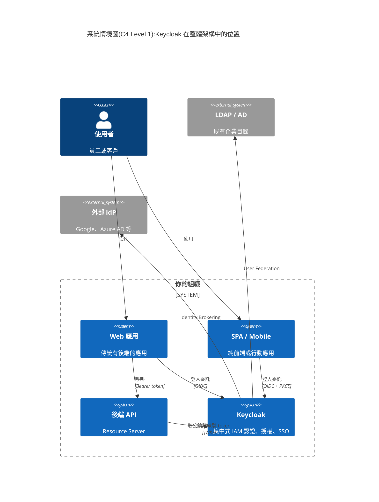
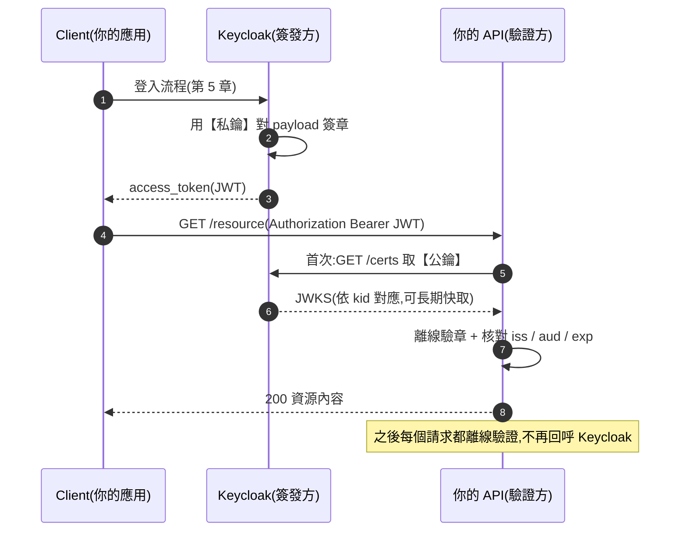
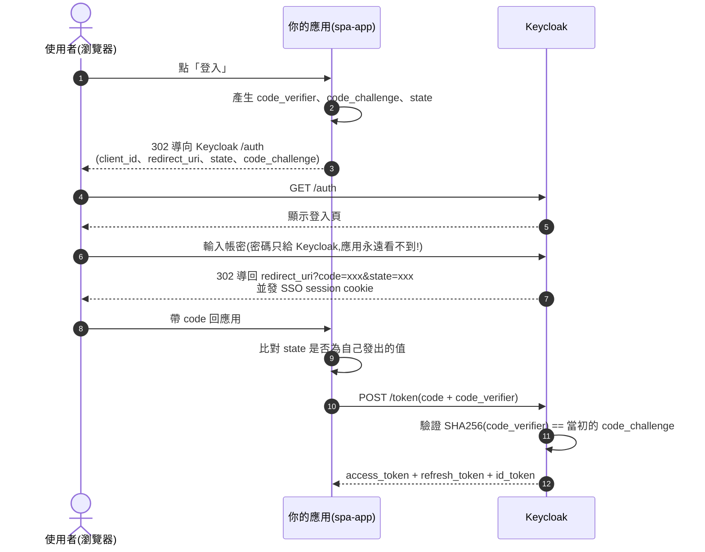
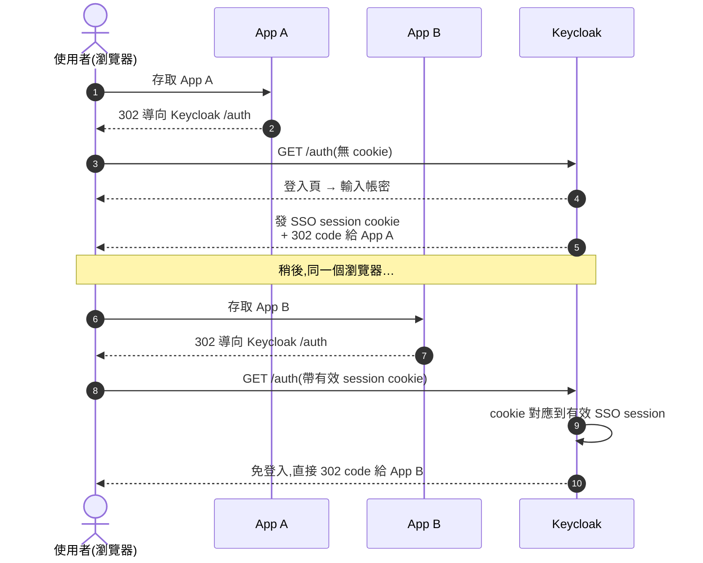

# Keycloak 初學者完整學習教材(實作驗證版)

> 這是一份**從零開始、每個指令都實際驗證過**的 Keycloak 動手教材。
> 所有指令與輸出均於 **Keycloak 26.2.5**(Docker, 2026-08-13)實測通過,共 40+ 項驗證全數成功(詳見[附錄 A:驗證報告](#附錄-a驗證報告))。
>
> 本教材與 [`keycloak-poc.md`](./keycloak-poc.md) 搭配使用:
> - **README.md(本文)**:初學者動手教材 — 跟著做,建立第一手的體感與正確心智模型
> - **`keycloak-poc.md`**:完整進階課綱(13 個 Module,從協定原理到生產部署)— 動手做完本教材後,依其學習路徑深入

---

## 目錄

- [第 0 章:Keycloak 是什麼?為什麼需要它?](#第-0-章keycloak-是什麼為什麼需要它)
- [第 1 章:環境準備與啟動](#第-1-章環境準備與啟動)
- [第 2 章:核心概念地圖](#第-2-章核心概念地圖)
- [第 3 章:建立你的第一個 Realm、Client 與 User](#第-3-章建立你的第一個-realmclient-與-user)
- [第 4 章:取得第一個 Token 並解剖 JWT](#第-4-章取得第一個-token-並解剖-jwt)
- [第 5 章:Authorization Code Flow + PKCE 完整實作](#第-5-章authorization-code-flow--pkce-完整實作)
- [第 6 章:動手驗證安全機制](#第-6-章動手驗證安全機制)
- [第 7 章:其他必會端點](#第-7-章其他必會端點)
- [第 8 章:Token 生命週期與 Session 模型](#第-8-章token-生命週期與-session-模型)
- [第 9 章:密碼儲存與簽章金鑰](#第-9-章密碼儲存與簽章金鑰)
- [第 10 章:組態匯出與環境管理入門](#第-10-章組態匯出與環境管理入門)
- [第 11 章:清理環境與下一步學習路徑](#第-11-章清理環境與下一步學習路徑)
- [附錄 A:驗證報告](#附錄-a驗證報告)
- [附錄 B:疑難排解 FAQ](#附錄-b疑難排解-faq)
- [附錄 C:術語速查表](#附錄-c術語速查表)

---

## 第 0 章:Keycloak 是什麼?為什麼需要它?

### 0.1 問題:每套系統都自己管帳號密碼

想像公司有三套系統,各自維護自己的使用者資料表:

```
┌────────┐  ┌────────┐  ┌────────┐
│ App A  │  │ App B  │  │ App C  │
│ 自建帳密 │  │ 自建帳密 │  │ 自建帳密 │
└────────┘  └────────┘  └────────┘
```

問題馬上浮現:

- 使用者要記三組密碼,或到處用同一組(更危險)
- 員工離職,要到三個地方停權,漏一個就是資安漏洞
- 密碼策略、雙因子認證(MFA)、稽核紀錄,三套系統各做各的

### 0.2 解法:集中式身分與存取管理(IAM)

**Keycloak** 是一套開源的 IAM(Identity and Access Management)伺服器,把「登入」這件事從所有應用程式抽出來,集中處理:

```
┌────────┐  ┌────────┐  ┌────────┐
│ App A  │  │ App B  │  │ App C  │   ← 應用程式不再碰密碼
└───┬────┘  └───┬────┘  └───┬────┘
    └───────────┼───────────┘
                ▼
         ┌────────────┐
         │  Keycloak  │   ← 唯一的登入入口與信任來源
         └────────────┘
```

用 **C4 Model 的系統情境圖(Level 1)** 看 Keycloak 在整體架構中的位置 — 它對內是所有應用的登入委託對象,對外可以接既有目錄與第三方身分來源:



它提供:

| 能力 | 說明 |
|------|------|
| **認證(AuthN)** | 「你是誰?」— 帳密、OTP、Passkey、社群登入 |
| **授權(AuthZ)** | 「你能做什麼?」— 角色、群組、細緻政策 |
| **單一登入(SSO)** | 登入一次,所有接入的系統都通行 |
| **身分聯邦** | 接既有的 LDAP / Active Directory |
| **身分代理** | 委託 Google、Azure AD 等第三方登入 |

### 0.3 兩個必須先分清楚的協定

Keycloak 實作了兩個業界標準,初學最容易混淆:

- **OAuth 2.0**:是「**授權**」框架 — 解決「App 如何在不拿到你密碼的情況下,取得存取資源的受限權限」
- **OpenID Connect(OIDC)**:建立在 OAuth 2.0 之上的「**認證**」層 — 補上「登入的人是誰」

> 一句話記憶:**OAuth 給你一張門禁卡(Access Token),OIDC 給你一張身分證(ID Token)。**
> 深入原理見 `keycloak-poc.md` 的 Module 2 與 Module 3。

---

## 第 1 章:環境準備與啟動

### 1.1 前置需求

- Docker(本教材以 Docker 29.x 驗證)
- `curl`、`openssl`、`python3`(解析 JSON 與解碼 JWT 用)

### 1.2 啟動 Keycloak(開發模式)

```bash
docker run -d --name keycloak \
  -p 8080:8080 \
  -e KC_BOOTSTRAP_ADMIN_USERNAME=admin \
  -e KC_BOOTSTRAP_ADMIN_PASSWORD=admin \
  quay.io/keycloak/keycloak:26.2 start-dev
```

✅ **已驗證**:啟動約 7 秒完成,日誌顯示 `Keycloak 26.2.5 on JVM (powered by Quarkus 3.20.1) started`。

> **版本注意**:Keycloak 26 起,管理員帳號的環境變數是 `KC_BOOTSTRAP_ADMIN_USERNAME` / `KC_BOOTSTRAP_ADMIN_PASSWORD`(舊版教學常見的 `KEYCLOAK_ADMIN` 已淘汰)。這組帳號是「臨時開機帳號」,生產環境應在首次登入後建立正式管理員並移除它。

確認啟動成功(啟動需要約 10~15 秒,太早打端點會得到 `Expecting value: line 1 column 1` 這種 JSON 解析錯誤 — 那只是伺服器還沒就緒,不是你做錯了):

```bash
# 等待就緒(每 2 秒重試,最多 60 秒)
until curl -sf http://localhost:8080/realms/master/.well-known/openid-configuration >/dev/null; do
  echo "等待 Keycloak 啟動中..."; sleep 2
done

# 打 OIDC Discovery 端點確認
curl -s http://localhost:8080/realms/master/.well-known/openid-configuration | python3 -m json.tool | head -20
```

### 1.3 登入管理主控台

瀏覽器開啟 <http://localhost:8080>,以 `admin` / `admin` 登入 **Admin Console**。

### 1.4 `start-dev` 與 `start`(生產模式)的差異

| | `start-dev`(本教材) | `start`(生產) |
|---|---|---|
| 資料庫 | 內嵌 H2(檔案型) | 必須外接 DB(建議 PostgreSQL) |
| HTTPS | 關閉 | 強制(或明確設定反向代理) |
| Hostname 檢查 | 寬鬆 | 嚴格(必設 `KC_HOSTNAME`) |
| 用途 | 學習、開發 | 正式環境 |

> ⚠️ **`start-dev` 絕對不可用於生產環境**。生產部署(外接 DB、HA 叢集、Kubernetes)見 `keycloak-poc.md` Module 6 與 Module 11。

---

## 第 2 章:核心概念地圖

進 Admin Console 之前,先建立這張心智地圖 — 之後每個操作你都知道自己在動哪一層:

```
Keycloak 伺服器
└── Realm(領域)= 完全隔離的租戶邊界
    ├── Clients(客戶端)= 每一個接入 SSO 的「應用程式」
    │   ├── Protocol Mappers(決定 token 裡放哪些欄位)
    │   └── Roles(client 層級角色)
    ├── Users(使用者)
    │   ├── Credentials(密碼、OTP、Passkey…)
    │   ├── Role Mappings(角色指派)
    │   └── Groups(群組,可繼承角色)
    ├── Roles(realm 層級角色)
    ├── Authentication Flows(登入流程編排)
    └── Keys(簽發 token 用的金鑰組)
```

三個新手最常犯的觀念錯誤,先打預防針:

1. **`master` realm 只用來管理 Keycloak 本身** — 永遠不要把業務應用掛在 `master`,一律另建 realm。
2. **Realm 不是按「應用程式」切分的** — 一個 realm 裝多個 client(應用)。切分 realm 的依據是「使用者群體與政策是否獨立」,例如 `員工` 與 `客戶` 分兩個 realm。
3. **Client ≠ 使用者端** — 在 OAuth 術語中,Client 指「代表使用者存取資源的應用程式」,例如你的網站後端或 SPA,不是指瀏覽器或人。

---

## 第 3 章:建立你的第一個 Realm、Client 與 User

本章用 **Admin Console(UI)** 和 **Admin REST API(curl)** 各做一次 — UI 適合探索理解,API 適合自動化(生產環境的正規做法是組態即程式碼)。

### 3.1 方式一:Admin Console 操作

1. **建立 Realm**:左上角 realm 下拉選單 → **Create realm** → Realm name 輸入 `demo` → **Create**
2. **建立 Client**(機密客戶端,模擬有後端的 Web App):
   - 左側 **Clients** → **Create client**
   - Client ID:`web-app`,Client type:`OpenID Connect` → Next
   - **Client authentication: On**(這就是「機密客戶端」,會有 client secret)→ Next
   - Valid redirect URIs:`http://localhost:3000/callback` → Save
   - 到 **Credentials** 頁籤可看到 Client Secret
3. **建立 User**:
   - 左側 **Users** → **Create new user** → Username:`alice` → Create
   - **Credentials** 頁籤 → **Set password** → 密碼 `alice-password`,**Temporary 關閉** → Save

### 3.2 方式二:Admin REST API(本教材實測採用)

先取得管理員的 access token:

```bash
ADMIN_TOKEN=$(curl -s -X POST http://localhost:8080/realms/master/protocol/openid-connect/token \
  -d grant_type=password -d client_id=admin-cli \
  -d username=admin -d password=admin \
  | python3 -c 'import sys,json;print(json.load(sys.stdin)["access_token"])')
```

建立 realm、兩個 client(機密 + 公開)、一個使用者:

```bash
# 建立 realm「demo」
curl -s -X POST http://localhost:8080/admin/realms \
  -H "Authorization: Bearer $ADMIN_TOKEN" -H "Content-Type: application/json" \
  -d '{"realm": "demo", "enabled": true}'

# 機密客戶端 web-app(有 secret,模擬有後端的傳統 Web App)
curl -s -X POST http://localhost:8080/admin/realms/demo/clients \
  -H "Authorization: Bearer $ADMIN_TOKEN" -H "Content-Type: application/json" \
  -d '{
    "clientId": "web-app", "enabled": true, "protocol": "openid-connect",
    "publicClient": false, "secret": "web-app-secret",
    "standardFlowEnabled": true, "directAccessGrantsEnabled": true,
    "redirectUris": ["http://localhost:3000/callback"]
  }'

# 公開客戶端 spa-app(無 secret,模擬 SPA;強制 PKCE)
curl -s -X POST http://localhost:8080/admin/realms/demo/clients \
  -H "Authorization: Bearer $ADMIN_TOKEN" -H "Content-Type: application/json" \
  -d '{
    "clientId": "spa-app", "enabled": true, "protocol": "openid-connect",
    "publicClient": true, "standardFlowEnabled": true,
    "redirectUris": ["http://localhost:3000/callback"],
    "attributes": {"pkce.code.challenge.method": "S256"}
  }'

# 使用者 alice
curl -s -X POST http://localhost:8080/admin/realms/demo/users \
  -H "Authorization: Bearer $ADMIN_TOKEN" -H "Content-Type: application/json" \
  -d '{
    "username": "alice", "enabled": true, "emailVerified": true,
    "email": "alice@example.com", "firstName": "Alice", "lastName": "Wang",
    "credentials": [{"type": "password", "value": "alice-password", "temporary": false}]
  }'
```

✅ **已驗證**:以上指令在 26.2.5 全部成功(回傳 201)。

> **為什麼建兩種 client?**
> - `web-app`(機密客戶端):程式碼跑在伺服器上,能安全保存 `client_secret`
> - `spa-app`(公開客戶端):程式碼跑在瀏覽器裡,人人可讀,**無法**保密 secret → 必須用 PKCE(第 5 章)

---

## 第 4 章:取得第一個 Token 並解剖 JWT

### 4.1 先用最簡單的方式拿到 token

用 Password Grant(直接對 token 端點送帳密)先拿到一組 token 來觀察:

```bash
curl -s -X POST http://localhost:8080/realms/demo/protocol/openid-connect/token \
  -d grant_type=password \
  -d client_id=web-app -d client_secret=web-app-secret \
  -d username=alice -d password=alice-password \
  -d 'scope=openid profile email' \
  | python3 -m json.tool
```

> ⚠️ **Password Grant(ROPC)已被 OAuth 2.1 廢棄,僅供本章教學觀察用** — 它讓應用程式直接經手使用者密碼,違背 OAuth 的設計初衷。真實應用一律使用第 5 章的 Authorization Code + PKCE。

回應包含三種 token(✅ 實測輸出):

```json
{
  "access_token": "eyJhbGciOiJSUzI1NiIs...",
  "expires_in": 300,
  "refresh_expires_in": 1800,
  "refresh_token": "eyJhbGciOiJIUzUxMiIs...",
  "id_token": "eyJhbGciOiJSUzI1NiIs...",
  "token_type": "Bearer",
  "session_state": "…", "scope": "openid email profile"
}
```

### 4.2 三種 Token 各司其職(必背)

| | ID Token | Access Token | Refresh Token |
|---|---|---|---|
| 給誰用 | **Client**(你的應用) | **Resource Server**(API) | 只還給 Keycloak 的 token 端點 |
| 回答什麼 | 「登入的人是誰」 | 「能存取什麼」 | 「幫我換一組新的」 |
| 實測壽命 | 跟隨 session | **300 秒(5 分鐘)** | **1800 秒(30 分鐘,滑動)** |
| 常見錯誤 | ❌ 拿去呼叫 API | ✅ 放在 `Authorization: Bearer` 標頭 | ❌ 傳給任何其他服務 |

### 4.3 解剖 JWT:三段式結構

JWT 長這樣:`Header.Payload.Signature`,前兩段只是 **Base64URL 編碼(不是加密!)**,任何人都能解開來讀。

先把 token 抓進變數(不必手動複製貼上 — 重打一次 4.1 的請求,順手把 access_token 與 refresh_token 存起來,後面章節都會用到):

```bash
RESP=$(curl -s -X POST http://localhost:8080/realms/demo/protocol/openid-connect/token \
  -d grant_type=password \
  -d client_id=web-app -d client_secret=web-app-secret \
  -d username=alice -d password=alice-password \
  -d 'scope=openid profile email')
AT=$(echo "$RESP" | python3 -c 'import sys,json;print(json.load(sys.stdin)["access_token"])')
RT=$(echo "$RESP" | python3 -c 'import sys,json;print(json.load(sys.stdin)["refresh_token"])')
```

然後解碼 header 與 payload:

```bash
echo $AT | cut -d. -f1 | python3 -c 'import sys,base64,json; s=sys.stdin.read().strip(); print(json.dumps(json.loads(base64.urlsafe_b64decode(s+"=="))), sep="\n")'
echo $AT | cut -d. -f2 | python3 -c 'import sys,base64,json; s=sys.stdin.read().strip(); print(json.dumps(json.loads(base64.urlsafe_b64decode(s+"==")), indent=2))'
```

**Header(✅ 實測輸出):**

```json
{ "alg": "RS256", "typ": "JWT", "kid": "A5_GdxMGJgYaEwJh1rFqQGn7iWcMKjBZXmb4vczPpow" }
```

- `alg`:簽章演算法(RS256 = RSA + SHA-256)
- `kid`:Key ID — 告訴驗證方去 JWKS 端點拿「哪一把」公鑰來驗章

**Payload 重點欄位(✅ 實測值):**

| Claim | 實測值 | 意義 |
|-------|--------|------|
| `iss` | `http://localhost:8080/realms/demo` | 簽發者 = realm URL,驗證方必須核對 |
| `sub` | `ffb6bcf4-…`(UUID) | 使用者的唯一識別 |
| `exp` − `iat` | 300 秒 | 有效期 5 分鐘 |
| `typ` | `Bearer` | Token 類型 |
| `azp` | `web-app` | 哪個 client 請求的 |
| `realm_access.roles` | `["offline_access", "uma_authorization", "default-roles-demo"]` | realm 層級角色 |
| `preferred_username` | `alice` | 使用者名稱 |
| `scope` | `openid email profile` | 授權範圍 |

而 **ID Token** 的 `aud`(audience)實測為 `web-app` —— 它的觀眾是 client 自己,**這就是 ID Token 不能拿去呼叫 API 的原因**:API 驗 `aud` 時本來就該拒絕它。

### 4.4 為什麼 API 驗 token 不用連 Keycloak?(核心觀念)



- 沒有私鑰,任何人都**偽造不了**簽章 → API 只要用公鑰驗章即可信任 token 內容
- 這是**離線行為** → API 可水平擴展、Keycloak 不會成為每個請求的瓶頸
- **代價**:簽出去的 token 過期前**無法撤回** → 所以 Access Token 才設計成只有 5 分鐘壽命

公鑰在這裡(✅ 已驗證,`kid` 與 token header 對得上):

```bash
curl -s http://localhost:8080/realms/demo/protocol/openid-connect/certs | python3 -m json.tool
```

---

## 第 5 章:Authorization Code Flow + PKCE 完整實作

這是**真實應用該用的登入流程**。我們不用任何 SDK,純手工走一遍,徹底理解每個參數。

### 5.1 流程總覽



**為什麼繞這麼一大圈?**

| 設計 | 理由 |
|------|------|
| 不直接回傳 token,先給一次性的 `code` | token 若走瀏覽器 URL 會留在歷史紀錄、Referer、代理 log 裡 |
| `state` 隨機值來回比對 | 防 CSRF:確認這個 callback 是自己發起的 |
| `redirect_uri` 必須預先註冊且精確比對 | 攻擊者無法把 code 導到自己的網址 |
| PKCE(`code_challenge` / `code_verifier`) | 公開客戶端沒有 secret,PKCE 充當「動態的一次性 secret」 |

### 5.2 完整實作腳本(✅ 已驗證)

**逐段貼到目前的終端機執行**(或存成 `authcode-lab.sh` 後用 `source authcode-lab.sh` 執行)。
注意:**不要用 `bash authcode-lab.sh` 跑** — 那會在子 shell 執行,`$CODE`、`$VERIFIER`、cookie jar 等變數會隨腳本結束消失,第 6 章的實驗就接不上了:

```bash
BASE=http://localhost:8080
REALM=demo
CLIENT=spa-app
REDIRECT=http://localhost:3000/callback
JAR=$(mktemp)   # cookie jar,模擬瀏覽器

# ── 步驟 1:產生 PKCE 參數 ──────────────────────────────
# code_verifier:高熵隨機字串(43~128 字元)
VERIFIER=$(openssl rand -base64 60 | tr -d '=+/\n' | cut -c1-64)
# code_challenge = BASE64URL( SHA256(code_verifier) )
CHALLENGE=$(printf '%s' "$VERIFIER" | openssl dgst -sha256 -binary \
            | openssl base64 -A | tr '+/' '-_' | tr -d '=')
STATE=$(openssl rand -hex 12)

# ── 步驟 2:GET 授權端點,拿到登入頁(保留 cookie)──────────
AUTH_URL="$BASE/realms/$REALM/protocol/openid-connect/auth?response_type=code&client_id=$CLIENT&redirect_uri=http%3A%2F%2Flocalhost%3A3000%2Fcallback&scope=openid%20profile&state=$STATE&code_challenge=$CHALLENGE&code_challenge_method=S256"
LOGIN_PAGE=$(curl -s -c "$JAR" "$AUTH_URL")
# 登入表單的提交網址藏在 HTML 的 action 屬性裡
ACTION=$(printf '%s' "$LOGIN_PAGE" | grep -oP 'action="\K[^"]+' | head -1 | sed 's/&amp;/\&/g')

# ── 步驟 3:提交帳密,Keycloak 302 導回 redirect_uri 帶 code ──
LOC=$(curl -s -b "$JAR" -c "$JAR" -o /dev/null -w '%{redirect_url}' \
  -d 'username=alice' -d 'password=alice-password' "$ACTION")
CODE=$(printf '%s' "$LOC" | grep -oP 'code=\K[^&]+' | head -1)
echo "拿到 authorization code:${CODE:0:20}..."

# ── 步驟 4:用 code + code_verifier 兌換 token(公開客戶端,無 secret!)──
TOKENS=$(curl -s -X POST "$BASE/realms/$REALM/protocol/openid-connect/token" \
  -d grant_type=authorization_code -d client_id=$CLIENT \
  -d code="$CODE" -d redirect_uri="$REDIRECT" \
  -d code_verifier="$VERIFIER")
echo "$TOKENS" | python3 -m json.tool
# 存下 access token,第 6 章的實驗會用到
AT=$(echo "$TOKENS" | python3 -c 'import sys,json;print(json.load(sys.stdin)["access_token"])')
```

✅ **實測結果**:成功取得 access token —— 全程沒有用到任何 client secret,這就是 PKCE 讓公開客戶端安全走完授權流程的價值。

---

## 第 6 章:動手驗證安全機制

教材說的安全設計,別背,**動手打打看**。以下四個實驗全部 ✅ 實測通過。

### 實驗 1:Authorization Code 是一次性的

拿第 5 章用過的 code 再兌換一次:

```bash
curl -s -X POST http://localhost:8080/realms/demo/protocol/openid-connect/token \
  -d grant_type=authorization_code -d client_id=spa-app \
  -d code="$CODE" -d redirect_uri=http://localhost:3000/callback \
  -d code_verifier="$VERIFIER"
```

**實測結果**:HTTP 400 `invalid_grant` —— code 只能用一次。

**更精彩的是**:Keycloak 偵測到 code 重放後,會把**第一次兌換成功發出的 token 一併撤銷**(RFC 6749 的建議行為)。用 introspection 檢查剛才拿到的 access token:

```bash
curl -s -X POST http://localhost:8080/realms/demo/protocol/openid-connect/token/introspect \
  -u web-app:web-app-secret -d token="$AT"
# 實測:{"active": false} ← 已被撤銷
```

> 這個設計的威力:即使攻擊者偷到 code 搶先兌換,只要合法 client 也去兌換,雙方的 token 全部作廢,攻擊者拿到的東西立刻失效。

### 實驗 2:錯誤的 code_verifier 會被拒絕

第 5 章的 code 已在實驗 1 用掉了,先拿一個新的 code(沿用 cookie jar,你會發現**不需要重新登入** — 這正是實驗 4 要講的 SSO):

```bash
VERIFIER2=$(openssl rand -base64 60 | tr -d '=+/\n' | cut -c1-64)
CHALLENGE2=$(printf '%s' "$VERIFIER2" | openssl dgst -sha256 -binary \
             | openssl base64 -A | tr '+/' '-_' | tr -d '=')
AUTH_URL2="$BASE/realms/$REALM/protocol/openid-connect/auth?response_type=code&client_id=$CLIENT&redirect_uri=http%3A%2F%2Flocalhost%3A3000%2Fcallback&scope=openid&state=demo2&code_challenge=$CHALLENGE2&code_challenge_method=S256"
LOC2=$(curl -s -b "$JAR" -o /dev/null -w '%{redirect_url}' "$AUTH_URL2")
CODE2=$(printf '%s' "$LOC2" | grep -oP 'code=\K[^&]+' | head -1)
```

然後用正確的 code、**錯誤的 verifier** 兌換:

```bash
curl -s -X POST http://localhost:8080/realms/demo/protocol/openid-connect/token \
  -d grant_type=authorization_code -d client_id=spa-app \
  -d code="$CODE2" -d redirect_uri=http://localhost:3000/callback \
  -d code_verifier="wrong-verifier-wrong-verifier-wrong-verifier-1234567"
```

**實測結果**:

```json
{"error": "invalid_grant", "error_description": "PKCE verification failed: Code mismatch"}
```

Keycloak 把收到的 `code_verifier` 重算 SHA-256,與當初的 `code_challenge` 比對,不符就拒發。**攻擊者就算攔截到 code 與 code_challenge,因 SHA-256 的單向性也推不回 verifier。**

### 實驗 3:state 原樣返回(CSRF 防護)

觀察第 5 章步驟 3 的 redirect URL:`?state=<你送出的隨機值>&code=…` —— ✅ 實測 state 原封不動返回。真實應用要比對它與自己發出的值,不符即中止流程。

### 實驗 4:SSO 的本質 —— 一顆發給 Keycloak 網域的 Cookie

其實你在實驗 2 已經親眼看過了:拿新 code 時,只因為帶著第 5 章的 cookie jar(裡面有 `AUTH_SESSION_ID`、`KEYCLOAK_IDENTITY` 等 cookie),Keycloak **沒有再顯示登入頁**,直接 302 發新的 code 回來。把 redirect URL 印出來看:

```bash
echo "$LOC2"
# http://localhost:3000/callback?state=demo2&session_state=…&code=…  ← 免登入直接發 code
```

這就是 SSO 的全部秘密:
- 使用者的登入狀態存在「**對 Keycloak 網域**」的 session cookie 裡(不是對各應用)
- App B 把使用者導到 Keycloak → Keycloak 看到有效 cookie → 免登入直接發 code
- 對使用者來說就是「登入一次,到處通行」



---

## 第 7 章:其他必會端點

### 7.1 Discovery:一個 URL 自動發現所有端點

```bash
curl -s http://localhost:8080/realms/demo/.well-known/openid-configuration | python3 -m json.tool
```

✅ 實測回傳所有端點位置與能力宣告,包括(擷取):

| 欄位 | 值 |
|------|-----|
| `issuer` | `http://localhost:8080/realms/demo` |
| `token_endpoint` | `…/protocol/openid-connect/token` |
| `jwks_uri` | `…/protocol/openid-connect/certs` |
| `code_challenge_methods_supported` | 含 `S256`(PKCE) |
| `grant_types_supported` | 含 `authorization_code`、`client_credentials`、`refresh_token`、`device_code`、`token-exchange`、`ciba` 等 |

各語言的 OIDC 函式庫(如 Spring Security)只需設定 issuer URL,其餘全部自動發現 — 這就是第 7.6 節 Spring 設定只有一行的原因。

### 7.2 Refresh Token:換發新的 Access Token

```bash
curl -s -X POST http://localhost:8080/realms/demo/protocol/openid-connect/token \
  -d grant_type=refresh_token -d client_id=web-app -d client_secret=web-app-secret \
  -d refresh_token="$RT" | python3 -m json.tool
```

✅ 實測成功取得一組**新的** access token。Access Token 5 分鐘就過期,應用靠這個機制在背景無感續期。

### 7.3 Token Introspection:線上查驗 token(RFC 7662)

```bash
curl -s -X POST http://localhost:8080/realms/demo/protocol/openid-connect/token/introspect \
  -u web-app:web-app-secret -d token="$AT" | python3 -m json.tool
# 實測:{"active": true, "username": "alice", ...}
```

與「離線驗 JWT」互為權衡:introspection **能即時反映撤銷**,但每次都要一趟網路呼叫。

### 7.4 UserInfo:用 Access Token 換使用者屬性

```bash
curl -s http://localhost:8080/realms/demo/protocol/openid-connect/userinfo \
  -H "Authorization: Bearer $AT" | python3 -m json.tool
```

✅ 實測回傳:

```json
{
  "sub": "ffb6bcf4-…", "email_verified": true, "name": "Alice Wang",
  "preferred_username": "alice", "given_name": "Alice",
  "family_name": "Wang", "email": "alice@example.com"
}
```

### 7.5 Client Credentials:服務對服務(M2M),沒有使用者

批次程式、微服務之間的呼叫,沒有「人」參與,用 client 自己的憑證換 token:

```bash
# 建立一個啟用 service account 的 client
curl -s -X POST http://localhost:8080/admin/realms/demo/clients \
  -H "Authorization: Bearer $ADMIN_TOKEN" -H "Content-Type: application/json" \
  -d '{"clientId": "batch-service", "enabled": true, "protocol": "openid-connect",
       "publicClient": false, "secret": "batch-secret",
       "standardFlowEnabled": false, "serviceAccountsEnabled": true}'

# 用 client 憑證直接換 token(沒有登入頁、沒有使用者)
curl -s -X POST http://localhost:8080/realms/demo/protocol/openid-connect/token \
  -d grant_type=client_credentials \
  -d client_id=batch-service -d client_secret=batch-secret | python3 -m json.tool
```

✅ 實測:token 的 `preferred_username` 為 `service-account-batch-service` —— Keycloak 為每個啟用 service account 的 client 建立一個影子使用者。

### 7.6 一行設定接上 Spring Boot(延伸)

你的 API(Resource Server)只需要:

```yaml
spring:
  security:
    oauth2:
      resourceserver:
        jwt:
          issuer-uri: http://localhost:8080/realms/demo
```

Spring 會自動抓 discovery → 取得 JWKS → 快取公鑰 → 離線驗每個請求的 JWT。完整整合(含角色映射、BFF、token exchange)見 `keycloak-poc.md` Module 7。

### 7.7 Grant Type 選型速查

```
你的客戶端是?
├─ 有使用者互動
│   ├─ 有後端的 Web App ──▶ Authorization Code(+ PKCE)
│   ├─ SPA / Mobile     ──▶ Authorization Code + PKCE(公開客戶端)
│   └─ 無瀏覽器裝置(TV) ──▶ Device Authorization Grant
└─ 服務對服務(M2M)     ──▶ Client Credentials

❌ 永遠不要再用:Implicit Flow、Password Grant(ROPC)
```

---

## 第 8 章:Token 生命週期與 Session 模型

### 8.1 實測的預設值(Keycloak 26.2.5)

| 設定 | 實測預設值 | 設計理由 |
|------|-----------|---------|
| Access Token Lifespan | **300 秒(5 分鐘)** | JWT 簽出去就收不回,短命縮小暴露窗 |
| Authorization Code | **60 秒** | 只是兌換憑證,用完即丟 |
| SSO Session Idle | **1800 秒(30 分鐘)** | 閒置逾時(refresh token 壽命跟著它) |
| SSO Session Max | **36000 秒(10 小時)** | 無論多活躍,最長登入時間 |

位置:Admin Console → 選 `demo` realm → **Realm settings** → **Sessions / Tokens** 頁籤。

### 8.2 Session 與 Token 的關係

```
瀏覽器                          Keycloak
┌──────────────────┐            ┌────────────────────────────────┐
│ Cookie:           │            │ SSO Session(登入狀態本體)        │
│ AUTH_SESSION_ID   │◀── 對應 ──▶│  ├─ Client Session: web-app    │
│ KEYCLOAK_IDENTITY │            │  ├─ Client Session: spa-app    │
└──────────────────┘            │  └─ …每個應用一個                │
                                └────────────────────────────────┘
```

- **登入狀態的本體是 Keycloak 的 session**,token 只是它的「短期產物」
- Refresh token 綁著 session:session 逾時/被登出 → refresh 立刻失效
- 26.x 起 session **預設持久化到資料庫**(`persistent-user-sessions` 功能),伺服器重啟使用者不再被登出

### 8.3 觀察線上 session

Admin Console → **Users** → alice → **Sessions** 頁籤,可看到她目前的 SSO session 與登入的 client,並可強制登出(session 銷毀後,她的 refresh token 立即失效 — 這就是「集中停權」的實作基礎)。

---

## 第 9 章:密碼儲存與簽章金鑰

### 9.1 密碼是怎麼存的?(✅ 實測)

用 Admin API 查 alice 的密碼憑證中繼資料:

```bash
UID=$(curl -s -H "Authorization: Bearer $ADMIN_TOKEN" \
  "http://localhost:8080/admin/realms/demo/users?username=alice" \
  | python3 -c 'import sys,json;print(json.load(sys.stdin)[0]["id"])')
curl -s -H "Authorization: Bearer $ADMIN_TOKEN" \
  "http://localhost:8080/admin/realms/demo/users/$UID/credentials" | python3 -m json.tool
```

實測的 `credentialData`:

```json
{
  "hashIterations": 5,
  "algorithm": "argon2",
  "additionalParameters": {
    "hashLength": ["32"], "memory": ["7168"],
    "type": ["id"], "version": ["1.3"], "parallelism": ["1"]
  }
}
```

解讀:

- 密碼以 **Argon2id** 雜湊儲存(**Keycloak 24 起的預設**;更早是 PBKDF2-SHA512)— 永遠不存明文
- `memory: 7168` KB:Argon2 刻意吃記憶體,讓 GPU 大規模暴力破解變得昂貴
- 每個使用者的 salt 都不同 → 彩虹表無效
- 伺服器同時內建 `argon2`、`pbkdf2-sha512` 等 provider(✅ 實測),可用 Password Policy 切換與調參 — 這是「安全 vs 登入吞吐量」的權衡點(調高成本,登入 TPS 直接下降)

### 9.2 簽章金鑰與輪替

```bash
curl -s http://localhost:8080/realms/demo/protocol/openid-connect/certs | python3 -m json.tool
```

✅ 實測:JWKS 回傳兩把金鑰 — `RS256`(簽章用)與 `RSA-OAEP`(加密用),各有唯一 `kid`。

**金鑰輪替的原理**(為什麼換金鑰不會讓服務中斷):

1. 新增一把新金鑰設為 Active → 之後的新 token 用新鑰簽(新 `kid`)
2. 舊金鑰保留為 Passive → 尚未過期的舊 token 仍能靠舊 `kid` 找到公鑰驗章
3. 等舊 token 全部過期(最長 5 分鐘)→ 安全移除舊金鑰

驗證方永遠靠 token header 的 `kid` 選對公鑰 — 這就是 `kid` 存在的意義。

---

## 第 10 章:組態匯出與環境管理入門

### 10.1 用 Admin API 匯出 realm 組態(✅ 實測可用)

```bash
curl -s -X POST -H "Authorization: Bearer $ADMIN_TOKEN" \
  "http://localhost:8080/admin/realms/demo/partial-export?exportClients=true&exportGroupsAndRoles=true" \
  > demo-realm-export.json
```

✅ 實測成功匯出 realm 與全部 client 定義(注意:partial-export **不含使用者與 secret**)。

### 10.2 ⚠️ 陷阱實錄:`kc.sh export` 在 dev 模式會失敗

教科書上的完整匯出指令:

```bash
docker exec keycloak /opt/keycloak/bin/kc.sh export --dir /tmp/export --realm demo
```

**實測結果:失敗** — `ERROR: Database may be already in use: "/opt/keycloak/data/h2/keycloakdb.mv.db"`。

原因:`start-dev` 用的內嵌 H2 是單連線檔案型資料庫,被運行中的伺服器鎖住。解法:

1. 先 `docker stop keycloak`,再用同一個資料卷跑一次性的 export 容器;或
2. 使用外接 PostgreSQL(生產模式本來就必須),export 即可與服務並行;或
3. 用 10.1 的 partial-export API(不停機,但不含使用者)

### 10.3 組態即程式碼(原則)

生產環境的鐵律:**Admin Console 只用來探索,正式變更一律走版控** — 工具有 `keycloak-config-cli`(宣告式 JSON)與 Terraform Keycloak Provider。詳見 `keycloak-poc.md` Module 6。

---

## 第 11 章:清理環境與下一步學習路徑

### 11.1 清理

```bash
docker rm -f keycloak
```

### 11.2 你已經學會了什麼

完成本教材後,你已親手驗證:

- [x] 啟動 Keycloak、建立 realm / client / user(UI 與 API 雙路徑)
- [x] 三種 token 的分工與 JWT 三段式結構、每個核心 claim 的意義
- [x] Authorization Code + PKCE 完整流程(不靠 SDK)
- [x] 四個安全機制:code 一次性(+重放觸發撤銷)、PKCE 驗證、state、SSO cookie
- [x] Discovery、JWKS、introspection、userinfo、refresh、client credentials
- [x] Token 生命週期預設值與 session 模型
- [x] Argon2 密碼儲存與金鑰輪替原理

### 11.3 下一步:接上進階課綱

依 [`keycloak-poc.md`](./keycloak-poc.md) 的學習路徑繼續:

| 你的下一步 | 對應 Module | 內容 |
|-----------|-------------|------|
| 補齊協定理論 | M0–M4 | 密碼學基礎、OAuth/OIDC 規格細節、SAML |
| 理解產品內部 | M5–M6 | 架構剖析、Authentication Flow 引擎、生產組態 |
| 實戰整合 | M7 | Spring Boot / SPA / API Gateway 完整 Lab |
| 企業功能 | M8–M10 | LDAP 聯邦、身分代理、授權服務、SPI 擴充開發 |
| 生產部署 | M11–M13 | Kubernetes HA 叢集、安全維運、金融業實戰場景 |

---

## 附錄 A:驗證報告

**驗證環境**:Keycloak 26.2.5(`quay.io/keycloak/keycloak:26.2`)、Docker 29.6、WSL2,驗證日期 2026-08-13。方式:實際啟動伺服器,以腳本執行 40+ 項自動化檢查。

### A.1 驗證通過的重要宣稱(節錄)

| `keycloak-poc.md` 宣稱 | 實測結果 |
|------------------------|---------|
| `KC_BOOTSTRAP_ADMIN_*` 啟動指令(M6) | ✅ 26.2.5 啟動成功 |
| JWKS 端點 `/realms/{realm}/protocol/openid-connect/certs`(M1) | ✅ 存在,回傳含 `kid` 的公鑰 |
| Access Token 預設 5 分鐘(M1/M12) | ✅ `accessTokenLifespan=300` |
| Authorization code 短命「預設 60 秒」(M2) | ✅ `accessCodeLifespan=60` |
| Refresh token 預設 30 分滑動(M3) | ✅ `refresh_expires_in=1800`,綁 SSO idle |
| code 一次性;重放會撤銷已發 token(M2) | ✅ 重放回 400,且原 token introspect `active=false` |
| PKCE S256 驗證(M2) | ✅ 錯誤 verifier 回 `PKCE verification failed` |
| SSO = Keycloak 網域的 session cookie(M3) | ✅ 第二次授權請求免登入直接發 code |
| ID Token `aud` = client_id(M3) | ✅ 實測 `aud=web-app` |
| Token 端點支援 device_code / token-exchange / uma-ticket / CIBA(M2/M3/M9) | ✅ discovery `grant_types_supported` 列出 |
| PAR 端點存在(M3) | ✅ `…/ext/par/request` |
| 密碼以 Argon2(id)儲存(M1) | ✅ `algorithm=argon2, type=id, memory=7168` |
| FAPI client profiles 內建含 `fapi-2-security-profile`(M3/M13) | ✅ 另含 fapi-1、oauth-2-1 等 8 組 |
| `persistent-user-sessions` 26.x 預設啟用(M5/M11) | ✅ feature 為 `DEFAULT, enabled`(25 為 preview,26.0 起預設)|
| Service account = client credentials 的化身(M5) | ✅ username 為 `service-account-…` |

### A.2 發現的偏差與修正(讀 `keycloak-poc.md` 時請注意)

| 位置 | 原文 | 實測/查證修正 |
|------|------|--------------|
| M1 §1.1 | 「預設使用 Argon2(**26.x 起**)」 | Argon2 自 **Keycloak 24** 起即為非 FIPS 環境預設([KC 24 release notes](https://www.keycloak.org/docs/25.0.6/release_notes/index.html)) |
| M5 §5.5 | 「`sessions` 快取 Distributed(**預設 2 owners**)」 | 26.2 預設組態實測為 `sessions`/`clientSessions` **`owners=1`** 且 `max-count=10000`(因 session 已預設落 DB,Infinispan 退為快取);`owners=2` 僅 `authenticationSessions`,或關閉 persistent sessions 的舊制部署 |
| M3 §3.5 / M12 | DPoP 列為可用規格 | DPoP 在 26.2 為 **PREVIEW feature,預設停用**,需 `--features=dpop` 啟用 |
| M6 §6.3 | `kc.sh export` 作為匯出手段 | 對**運行中的 dev 模式(H2)**執行會因資料庫檔案鎖而失敗;需先停機、改用外部 DB,或改用 partial-export API |

### A.3 其他查證

- RFC 編號(6749/7636/7519/7662/8693/8628/9126/9449/8705/9700)與書目作者均正確
- SSO Session Max 預設為 10 小時(36000s),與 M12 建議值「8~10 小時」一致

## 附錄 B:疑難排解 FAQ

**Q:`curl` 打 token 端點回 `401 invalid_client`?**
A:機密客戶端(`publicClient: false`)必須帶 `client_secret`;公開客戶端則**不能**帶。確認 client 型別與參數一致。

**Q:授權請求回「Invalid parameter: redirect_uri」?**
A:redirect_uri 必須與 client 註冊值**精確比對**(這是防 code 竊取的安全設計,不是 bug)。檢查結尾斜線、埠號、http/https。

**Q:token 拿去驗證說 issuer 不符?**
A:`iss` 是簽發當下的 URL。你用 `localhost:8080` 拿的 token,`iss` 就是它;API 若設定 issuer 為 `127.0.0.1` 或容器內部主機名就會不符。生產環境務必設 `KC_HOSTNAME` 固定 issuer。

**Q:重啟容器後之前的設定不見了?**
A:本教材的 `docker run` 沒掛資料卷,`docker rm` 後 H2 資料就沒了。要保留:`-v keycloak-data:/opt/keycloak/data`。

**Q:管理員 token 一下就過期?**
A:admin token 也是 access token,預設 60 秒(master realm 的 admin-cli)~5 分鐘。重跑第 3.2 節第一條指令重取即可。

**Q:為什麼我照做 Password Grant 卻被拒?**
A:client 需開啟 `directAccessGrantsEnabled`(Admin Console 中叫「Direct access grants」)。再次強調:此 grant 僅供教學觀察。

## 附錄 C:術語速查表

| 術語 | 白話解釋 |
|------|---------|
| Realm | 一個完全隔離的「租戶」:自己的使用者、應用、政策 |
| Client | 在 Keycloak 註冊的「應用程式」(不是指瀏覽器) |
| 機密/公開客戶端 | 能不能安全保存 secret:後端能(機密)、瀏覽器/App 不能(公開) |
| Access Token | 門禁卡:呼叫 API 用,短命(5 分鐘) |
| ID Token | 身分證:告訴應用「登入的是誰」,不可拿去呼叫 API |
| Refresh Token | 換卡憑證:只還給 Keycloak 換新的 access token |
| JWT | 三段式(Header.Payload.Signature)可離線驗證的 token 格式 |
| Claim | JWT payload 裡的一筆欄位(如 `sub`、`email`) |
| JWKS | Keycloak 公開「驗章公鑰」的標準端點 |
| `kid` | Key ID:token 標頭指名「用哪把公鑰驗我」 |
| PKCE | 公開客戶端的動態一次性 secret(SHA-256 挑戰/應答) |
| Grant Type | 取得 token 的方式(authorization_code、client_credentials…) |
| Scope | 授權範圍(`openid profile email`…) |
| SSO Session | 使用者在 Keycloak 的登入狀態本體(cookie 對應) |
| Introspection | 線上向 Keycloak 查驗 token 是否有效(可反映撤銷) |
| Federation | 接既有使用者來源(LDAP/AD) |
| Brokering | 把認證委託給第三方 IdP(Google、Azure AD) |
| SPI | Keycloak 的擴充點:自訂認證步驟、事件監聽等 |

---

*教材驗證與撰寫:2026-08-13,基於 Keycloak 26.2.5。進階內容請接續 [`keycloak-poc.md`](./keycloak-poc.md)。*
